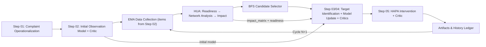

# PHOENIX Engine

Research-grade software for the Ghent University master's thesis on **personalised, iterative mental-health treatment optimisation**.

> **Status:** synthetic pseudodata pipeline — structured for future frontend integration with real EMA data.

## Academic Context

| | |
|---|---|
| **Institution** | Ghent University |
| **Author** | Stijn Van Severen |
| **Supervisors** | Geert Crombez, Annick De Paepe |

---

## What PHOENIX Does

PHOENIX (**P**ersonalized **H**ierarchical **O**ptimization **E**ngine for **N**avigating **I**nsightful e**X**plorations) operationalises mental-state support as a closed-loop, iterative data-analysis and decision-support workflow:

| Step | Component | Description |
|---|---|---|
| **01** | Complaint Operationalization | Free-text complaint → single CRITERION ontology leaf (HTSSF fusion + LLM adjudication) |
| **02** | Initial Observation Model | Criterion × predictor bipartite network (constructor + critic guardrail) |
| — | EMA Data Collection | Measurement items derived from Step 02 predictor set — collected *after* model approval |
| **HUA** | Hierarchical Updating Algorithm | Readiness → network analysis (tv-gVAR / gVAR) → momentary impact quantification |
| **BFS** | Candidate Selection | Ontology-constrained breadth-first search scoring ranked predictor paths |
| **03/04** | Target Identification + Model Update | LLM selects targets; fuses nomothetic × idiographic evidence (each with critic) |
| **05** | HAPA Intervention | Barrier scoring · coping selection · phased EMA delivery plan (+ critic) |
| — | History Ledger | Artefacts from cycle N seed cycle N+1 |

---

## Quick Start

```bash
# Single-cycle run (synthetic data)
python evaluation/integrated_pipeline/run_pipeline.py --mode synthetic_v1

# Multi-cycle with history
python evaluation/integrated_pipeline/run_pipeline.py --mode synthetic_v1 --cycles 3 --profile-memory-window 3

# Stricter ontology + guardrails
python evaluation/integrated_pipeline/run_pipeline.py --mode synthetic_v1 \
  --hard-ontology-constraint \
  --handoff-critic-max-iterations 2 \
  --intervention-critic-max-iterations 2

# Deterministic fallback (LLM disabled)
python evaluation/integrated_pipeline/run_pipeline.py --mode synthetic_v1 --disable-llm
```

---

## Frontend (Flask Debug UI)

```bash
python frontend/app.py
# or
python evaluation/integrated_pipeline/run_pipeline.py --ui
```

Open [http://127.0.0.1:5050](http://127.0.0.1:5050) — supports complaint/person/context intake, streamed stage logs, pseudodata synthesis, CSV upload, and iterative cycle execution.

---

## Pipeline Overview



---

## Repository Structure

```
MASTERPROEF/
├── src/
│   ├── SystemComponents/
│   │   ├── Agentic_Framework/          # LLM stages 01–05 (generator + critic each)
│   │   ├── Hierarchical_Updating_Algorithm/  # Readiness → network → impact
│   │   └── PHOENIX_ontology/           # CRITERION · PREDICTOR · PERSON · CONTEXT · HAPA
│   ├── overview/                       # Architecture diagram + README
│   └── utils/
├── evaluation/
│   ├── integrated_pipeline/            # run_pipeline.py entry point
│   ├── sequential/
│   └── quality_and_research/
│       ├── quality_assurance/
│       └── research_communication/
├── frontend/                           # Flask debug UI
├── pyproject.toml
└── requirements.txt
```

---

## Quality Assurance

```bash
make qa-unit
make qa-integration
```

- CI: `.github/workflows/ci.yml`
- Smoke test: `.github/workflows/smoke_pipeline.yml`
- Contract validation: `evaluation/quality_and_research/quality_assurance/validate_contract_schemas.py`

---

## LLM Reliability

- OpenRouter-first runtime: set `OPENROUTER_API_KEY` (default `gpt-5-nano`, routed as `openai/gpt-5-nano`).
- `.env` is auto-loaded by CLI/frontend launchers; OpenRouter keys are mirrored to legacy `OPENAI_*` env vars automatically.
- Integrated pipeline writes `llm_startup_health_check.json` at run start for auditable provider connectivity/auth checks.
- Shared runtime: retry, bounded auto-repair, structured JSON validation, model fallback.
- Actor-critic loops in Steps 02, 03, 04, 05 (max 2 revisions each).
- `--hard-ontology-constraint` enforces ontology-matched outputs on all key decisions.
- LLM-disabled mode remains schema-valid with impact-driven outputs.

---

## Data & Security

- `.env`, secrets, caches, and heavy run artefacts excluded via `.gitignore`.
- Ontology content versioned and protected.
- Large generated run outputs intentionally out of version control.

---

## License

`GPL-3.0` — see [`LICENSE`](./LICENSE).
