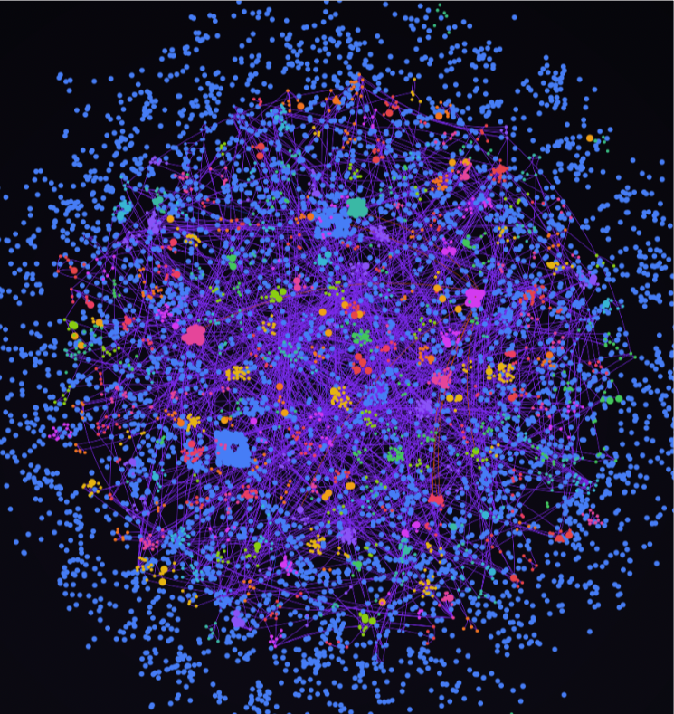

# PHOENIX Engine

PHOENIX is a modular, multi-agent system that starts from free-text complaints, builds an initial observation model, analyzes time-series dynamics, proposes targets/interventions, and packages iterative updates for the next cycle.

(**P**ersonalized **H**ierarchical **O**ptimization **E**ngine for **N**avigating **I**nsightful e**X**plorations)

## 🏛️ Academic Context
PHOENIX is a research-grade software for a Ghent University **master's thesis** on enhancing the clinical translation abilities of longitudinal **mental health applications**: towards an adaptive approach for **idiographic modelling** by using **ontologies and large language models**.

| | |
|---|---|
| **Institution** | Ghent University |
| **Author** | Stijn Van Severen |
| **Supervisors** | Geert Crombez, Annick De Paepe |

## 🧭 PHOENIX Scope

PHOENIX separates two concerns:

- **Core engine flow**: clinical/analytic decision flow from intake to iterative model carry-over.
- **Research support flow**: visualization, QA, and research reporting for validation and communication.

This separation keeps scientific validation transparent without mixing support tasks into core decision logic.

## 🔁 End-to-End Stage Map

The PHOENIX engine conceptualises mental-state support as a closed-loop workflow that iteratively optimizes the intervention proposal based on data from previous cycles.


## 🚀 Quick Setup (Clone to First Run)

### 1. Clone repository

```bash
git clone https://github.com/stvsever/ThesisMaster.git
cd MASTERPROEF
```

### 2. Create Python environment (3.11+)

```bash
python3 -m venv .venv
source .venv/bin/activate
python -m pip install --upgrade pip
pip install -r requirements.txt
```

### 3. Configure `.env` for LLM-enabled runs

Create or update `.env` in repository root:

```bash
OPENROUTER_API_KEY=<your_openrouter_key>
OPENAI_BASE_URL=https://openrouter.ai/api/v1
```

Runtime behavior:
- `OPENROUTER_API_KEY` is primary.
- Runtime mirrors it to `OPENAI_API_KEY` for backward-compatible scripts.
- Default model is `gpt-5-nano` (resolved as `openai/gpt-5-nano` when routed via OpenRouter).

### 4. Optional smoke validation

```bash
make pipeline-smoke
```

## 💻 Run PHOENIX from CLI

### A. Standard integrated run

```bash
python evaluation/integrated_pipeline/run_pipeline.py --mode synthetic_v1
```

### B. Single profile selection

```bash
python evaluation/integrated_pipeline/run_pipeline.py --mode synthetic_v1 \
  --pattern pseudoprofile_FTC_ID001 \
  --max-profiles 1
```

### C. Iterative run (2 cycles)

```bash
python evaluation/integrated_pipeline/run_pipeline.py --mode synthetic_v1 \
  --cycles 2 \
  --profile-memory-window 3
```

### D. Strict constraints + critic loops

```bash
python evaluation/integrated_pipeline/run_pipeline.py --mode synthetic_v1 \
  --hard-ontology-constraint \
  --handoff-critic-max-iterations 2 \
  --intervention-critic-max-iterations 2
```

### E. Enable support visualizations and parallelizable late branches

```bash
python evaluation/integrated_pipeline/run_engine_pipeline.py \
  --run-impact-visualizations \
  --parallel-branches \
  --visualization-dpi 300
```

### F. Deterministic fallback (LLM disabled)

```bash
python evaluation/integrated_pipeline/run_pipeline.py --mode synthetic_v1 --disable-llm
```

### G. Operator control (explicit run id + dry-run command preview)

```bash
python evaluation/integrated_pipeline/run_pipeline.py --mode synthetic_v1 \
  --run-id thesis_eval_batch_a \
  --dry-run \
  --print-effective-config
```

## 🖥️ Run PHOENIX from Frontend

Use the following command to start the Flask frontend:

```bash
python frontend/app.py
# or
python evaluation/integrated_pipeline/run_pipeline.py --ui
```

Open [http://127.0.0.1:5050](http://127.0.0.1:5050).

Frontend provides:
- Intake for complaint/person/environment context
- Live component status and streaming logs
- Step-level run controls and advanced configuration toggles
- Iterative-cycle execution and output inspection

## 📦 Outputs and Validation Targets

Integrated outputs are saved under:

```text
evaluation/integrated_pipeline/runs/<run_id>/
```

Key artifacts to inspect:
- `00_operationalization/` through `10_research_reports/`
- `pipeline_summary.json`
- `llm_startup_health_check.json`
- Stage logs (`stage.log`, `stage_events.jsonl`, `stage_trace.json`)
- Profile-specific JSON/CSV outputs per step

## 🗂️ Repository Structure

A client-side knowledge graph creator (GitNexus) was used to generate  a comprehensive knowledge graph of the entire codebase architecture and component interactions is provided below:

<div align="center">
  
</div>

```text
MASTERPROEF/
├── src/                               # Core engine logic and ontology-backed components
│   ├── SystemComponents/              # Agentic framework, HUA, intervention components
│   ├── utils/                         # Shared agentic runtime, mappings, feasibility utilities
│   └── overview/                      # Architecture visuals
├── evaluation/                        # Sequential scripts + integrated pipeline + QA/research
│   ├── sequential/                    # Stage-wise run_step.py scripts (00..08)
│   ├── integrated_pipeline/           # run_pipeline.py and run_engine_pipeline.py
│   └── quality_and_research/          # pytest suites, schema contracts, research reporting
├── frontend/                          # Flask app, UI routes, runtime workspace integration
├── .github/                           # CI/CD workflows
├── pyproject.toml                     # Python package metadata and constraints
├── requirements.txt                   # Dependency baseline
└── README.md                          # Root documentation
```

## ✅ Quality Assurance and CI/CD

Run locally:

```bash
make qa-unit
make qa-integration
make qa-smoke
make qa-all
```

Automated workflows:
- `.github/workflows/ci.yml`
- `.github/workflows/smoke_pipeline.yml`

Schema/contract validation entrypoint:
- `evaluation/quality_and_research/quality_assurance/validate_contract_schemas.py`

## 📜️ License

This project is licensed under **GNU General Public License v3.0**. See [`LICENSE`](./LICENSE).

What this means in practice:
- You may **use, study, modify, and redistribute** this code.
- If you distribute modified versions (or software that includes GPL-covered parts), you must:
  - keep it under GPL-compatible terms,
  - provide corresponding source code,
  - preserve copyright and license notices,
  - document meaningful changes.
- The software is provided **without warranty**.

For academic reuse, cite the thesis context appropriately and keep provenance of methodological changes explicit.

> [!CAUTION]
> **EU MDR / PRE-CLINICAL DISCLAIMER**
> PHOENIX is a **Clinical Decision Support System (CDSS) prototype** designed for research purposes. It is **NOT** a certified medical device under the EU Medical Device Regulation (MDR 2017/745) or FDA guidelines. Do not use for primary diagnostic decisions. All outputs must be verified by a qualified clinician.
