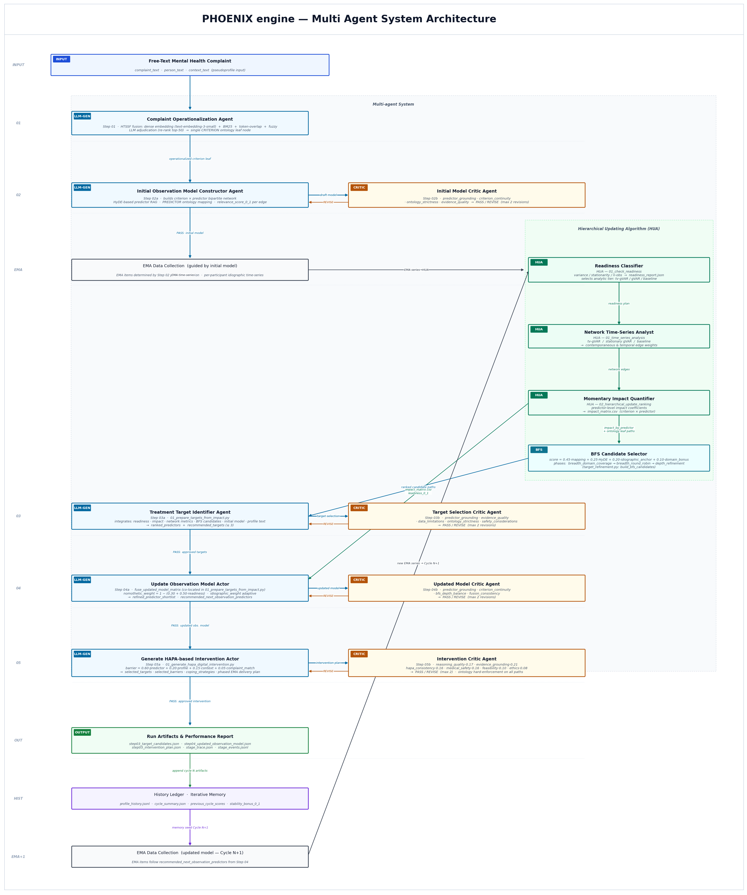

<div align="center">

  <h1>Enhancing Translational Abilities of Longitudinal Mental Health Applications: An Adaptive Approach to Idiographic Modelling by Leveraging Ontology-based Agentic AI</h1>

  <h2>🐦‍🔥 PHOENIX Engine</h2>

  <p>This repository contains the PHOENIX engine, the software system developed for the master's thesis above.</p>

  <p>The PHOENIX engine conceptualises mental health support as a closed-loop workflow that iteratively optimizes the intervention proposal based on data from previous cycles.</p>

  <p>(Personalized Hierarchical Optimization Engine for Navigating Insightful eXplorations)</p>

  <p>
    <a href="#"></a>
    <a href="#"></a>
    <a href="#"></a>
    <a href="#"></a>
  </p>

</div>

---

## 📋 Table of Contents

- [🏛️ Academic Context](#-academic-context)
- [🧭 PHOENIX Scope](#-phoenix-scope)
- [🔁 End-to-End Stage Map](#-end-to-end-stage-map)
- [🐦‍🔥 PHOENIX Ontology](#-phoenix-ontology-with-llm-based-mappings)
- [🏗️ Technical Architecture](#-technical-architecture)
- [🚀 Quick Setup](#-quick-setup-of-phoenix-engine)
- [🗂️ Repository Structure](#-repository-structure)
- [💻 Run from CLI](#-run-phoenix-from-cli)
- [🖥️ Run from Frontend](#-run-phoenix-from-frontend)
- [📦 Outputs and Validation](#-outputs-and-validation-targets)
- [📊 Survey Evaluation Framework](#-survey-evaluation-framework)
- [✅ Quality Assurance and CI/CD](#-quality-assurance-and-cicd)
- [🐳 Docker](#-docker)
- [📜 License](#-license)

---

## 🏛️ Academic Context

This research-grade software is being created for a Ghent University **master's thesis** that aims to enhance the clinical translation abilities of longitudinal **mental health applications**: toward an adaptive approach for **idiographic modelling** by using **ontologies and large language models**.

| **Field** | **Value** |
|---|---|
| **Institution** | Ghent University |
| **Author** | Stijn Van Severen |
| **Supervisors** | Geert Crombez, Annick De Paepe |

---

## 🧭 PHOENIX Scope

PHOENIX separates two concerns:

- **Core engine flow**: clinical/analytic decision flow from intake to iterative model carry-over.
- **Research support flow**: visualization, QA, and research reporting for validation and communication.

This separation keeps scientific validation transparent without mixing support tasks into core decision logic.

---

## 🔁 End-to-End Stage Map

PHOENIX is a modular, multi-agent system that starts from free-text complaints, builds an initial observation model, analyzes time-series dynamics, proposes targets/interventions, and packages iterative updates for the next cycle.



---

## 🐦‍🔥 PHOENIX Ontology with LLM-based Mappings

The following ontology was developed to support the PHOENIX engine's reasoning and decision-making processes.


---

## 🏗️ Technical Architecture

### Five PHOENIX Ontologies

All stages are constrained by five stable ontologies that enforce structural guarantees across the full pipeline:

| Ontology | Role | Source |
|---|---|---|
| **CRITERION** | Operationalized mental health variables (DSM-5-TR, RDoC) | `src/SystemComponents/PHOENIX_ontology/separate/CRITERION/` |
| **PREDICTOR** | Measurable constructs that temporally precede criteria | `src/SystemComponents/PHOENIX_ontology/separate/PREDICTOR/` |
| **PERSON** | Individual characteristics (demographics, comorbidity, history) | `src/SystemComponents/PHOENIX_ontology/separate/PERSON/` |
| **CONTEXT** | Situational and environmental factors | `src/SystemComponents/PHOENIX_ontology/separate/CONTEXT/` |
| **HAPA** | Health Action Process Approach (barriers, coping, phases) | `src/SystemComponents/PHOENIX_ontology/separate/HAPA/` |

### Multi-Agent Design

Each core stage pairs a **generator agent** with a **critic agent**:

| Stage | Generator | Critic Dimensions | Core Method |
|---|---|---|---|
| 01 | Complaint Operationalization Agent | — | HTSSF: hybrid temperature-scaled softmax fusion (dense + BM25 + token overlap + fuzzy) |
| 02 | Initial Model Constructor | predictor_grounding, criterion_continuity, ontology_strictness, evidence_quality | HyDE-based predictor RAG |
| 03 | Target Identifier + Model Update Actor | safety, domain_boundary, lineage_consistency | BFS candidate selector + idiographic-nomothetic fusion |
| 04 | HAPA Intervention Mapper | reasoning_quality, evidence_grounding, hapa_consistency, medical_safety | Barrier scoring: 0.60·predictor + 0.20·profile + 0.15·context + 0.05·complaint |

**Optional DAG orchestrator** (`src/backend/orchestrator.py`): for complex tasks, a flexible orchestrator creates DAG-based parallel/sequential execution plans — otherwise the pipeline runs sequentially (primary evaluation path).

### Hierarchical Updating Algorithm (HUA)

Quantitative backbone bridging EMA data to adaptive model weighting:

1. **Readiness classifier** — stationarity (ADF/KPSS), collinearity, effective sample size → tier selection (tv-gVAR / gVAR / GGM / correlation / descriptives)
2. **Network time-series analyst** — kernel-smoothed VAR(1), L1-penalized stationary gVAR, partial correlations (Ledoit-Wolf shrinkage), time-varying GIF animations
3. **Momentary impact quantifier** — leave-one-predictor-out MSE delta + coefficient magnitude composite
4. **BFS candidate selector** — `score = 0.45·mapping + 0.25·HyDE + 0.20·idiographic_anchor + 0.10·domain_bonus`

**Adaptive idiographic-nomothetic weighting** per cycle:
```
idiographic_weight = clamp(0.30 + 0.50 × readiness_score / 100)
nomothetic_weight  = 1.0 - idiographic_weight
```

### Iterative Cycle Design

PHOENIX implements a breadth-first iterative algorithm across cycles:

1. **Cycle N** produces: criterion leaf, initial model, pseudodata, HUA results, treatment targets, HAPA intervention
2. **Cycle N+1** seeds from Cycle N via a history ledger: impact scores → `idiographic_anchor` in BFS; prior cycle scores modulate `domain_bonus`; `composite_score = 0.35·similarity + 0.25·impact[N] + 0.15·target_scores + 0.10·priority_scores + 0.15·quality_scores`

---

## 🚀 Quick Setup of PHOENIX engine

### 1. Clone repository

```bash
git clone https://github.com/stvsever/ThesisMaster.git
cd MASTERPROEF
```

### 2. Create Python environment (3.11+)

```bash
python3 -m venv .venv
source .venv/bin/activate
python -m pip install --upgrade pip
pip install -r requirements.txt
```

### 3. Configure `.env` for LLM-enabled runs

Create or update `.env` in repository root:

```bash
OPENROUTER_API_KEY=<your_openrouter_key>
OPENAI_BASE_URL=https://openrouter.ai/api/v1
```

Runtime behavior:
- `OPENROUTER_API_KEY` is primary.
- Runtime mirrors it to `OPENAI_API_KEY` for backward-compatible scripts.
- Default model is `gpt-5-nano` (resolved as `openai/gpt-5-nano` when routed via OpenRouter).

### 4. Optional smoke validation

If you want to quickly validate the integrated pipeline on a single profile with minimal iterations, you can run the smoke test:

```bash
make pipeline-smoke
```

---

## 🗂️ Repository Structure

A client-side graph creator (GitNexus) was used to generate a comprehensive knowledge graph of the entire codebase; its component interactions are provided below:

<div align="center">
  
</div>

The main codebase is organized into three primary directories: `src/` for core engine logic, `evaluation/` for all evaluation scripts and research support, and `frontend/` for the Flask application. The structure is designed to maintain a clear separation of concerns while facilitating modular development and testing.

```text
MASTERPROEF/
├── src/                            # Core engine logic and ontology-backed components
│   ├── SystemComponents/              # Agentic framework, HUA, intervention components
│   ├── utils/                         # Shared agentic runtime, mappings, feasibility utilities
│   ├── frontend/                      # Flask app, UI routes, runtime workspace integration
│   └── backend/overview/              # Architecture visuals and codebase graph
├── evaluation/                     # Sequential scripts + integrated pipeline + QA/research
│   ├── sequential/                    # Stage-wise run_step.py scripts (00..08)
│   ├── integrated_pipeline/           # run_pipeline.py and run_engine_pipeline.py
│   ├── survey_analysis/               # 6-study evaluation framework with analysis scripts
│   └── quality_and_research/          # pytest suites, schema contracts, research reporting
├── docker/                         # Dockerfile + docker-compose for reproducible deployment
├── .github/                        # CI/CD workflows
├── pyproject.toml                  # Python package metadata and constraints
├── requirements.txt                # Dependency baseline
└── README.md                       # Root documentation
```

---

## 💻 Run PHOENIX from CLI

### A. Standard integrated run

The following command executes the full PHOENIX pipeline with default settings, processing the synthetic_v1 dataset through all stages and generating comprehensive outputs:

```bash
python evaluation/integrated_pipeline/run_pipeline.py --mode synthetic_v1
```

### B. Single profile selection

The following command runs the pipeline on the `synthetic_v1` dataset but limits the execution to a single profile matching the pattern `pseudoprofile_FTC_ID001`. This allows for focused testing and debugging on a specific case:

```bash
python evaluation/integrated_pipeline/run_pipeline.py --mode synthetic_v1 \
  --pattern pseudoprofile_FTC_ID001 \
  --max-profiles 1
```

### C. Iterative run (2 cycles)

The following command executes the PHOENIX pipeline for 2 complete cycles, allowing you to observe how the system iteratively refines its outputs based on previous cycle data. The `--profile-memory-window 3` flag enables the system to retain information from the last 3 profiles for informed decision-making in subsequent cycles:

```bash
python evaluation/integrated_pipeline/run_pipeline.py --mode synthetic_v1 \
  --cycles 2 \
  --profile-memory-window 3
```

### D. Deterministic mode (no LLM)

```bash
python evaluation/integrated_pipeline/run_pipeline.py --mode synthetic_v1 --disable-llm
```

Runtime note:
- If a cycle is `readiness_aligned` and only contemporaneous correlation analysis is feasible, PHOENIX now applies a correlation-baseline impact fallback so downstream Step-03/04/05 and communication stages still execute and persist outputs.
- If Step-02 model generation fails (for example provider/network failure), PHOENIX now builds complaint-grounded fallback Step-02 artifacts directly from Step-01 operationalization output, instead of copying unrelated historical profile artifacts.
- For iterative cycles started via `--start-from-pseudodata`, PHOENIX now resolves `initial_model_runs_root` from the active run lineage (same run id) so Step-03/04 stay anchored to the current cycle history.

---

## 🖥️ Run PHOENIX from Frontend

Use the following command to start the Flask frontend:

```bash
python src/frontend/app.py
# or
python evaluation/integrated_pipeline/run_pipeline.py --ui
```

Open [http://127.0.0.1:5050](http://127.0.0.1:5050).

Frontend provides:
- Intake for complaint/person/environment context
- Live component status and streaming logs
- One-click full end-to-end run from free-text complaint (with iterative cycle controls)
- Step-level run controls and advanced configuration toggles
- Wizard-style iterative execution: INTAKE → MODEL → DATA → ANALYSIS → INTERVENTION → MODEL (cycle N+1)
- Interactive Chart.js dashboard — all visualizations are dynamic (no static PNGs in UI)
- Canvas-based animated network visualization with per-frame scrubbing
- Session persistence and cohort batch execution

---

## 📦 Outputs and Validation Targets

Integrated outputs are saved under:

```text
evaluation/integrated_pipeline/runs/<run_id>/
```

Key artifacts to inspect:
- `00_operationalization/` through `10_research_reports/`
- `pipeline_summary.json`
- `llm_startup_health_check.json`
- Stage logs (`stage.log`, `stage_events.jsonl`, `stage_trace.json`)
- Profile-specific JSON/CSV outputs per step
- Profile-specific human-readable summaries:
  - `07_hapa_digital_intervention/<profile_id>/step05_hapa_intervention.md`
  - `08_treatment_translation_communication/<profile_id>/treatment_translation_communication.md`
- Time-varying network animation: `04_time_series_analysis/<profile_id>/tv_network_animation.gif`
- Publication-ready PNGs: `09_impact_visualizations/<profile_id>/` (for human healthcare expert comparison)

---

## 📊 Survey Evaluation Framework

The `evaluation/survey_analysis/` directory contains a complete 7-study statistical evaluation framework:

| Study | Name | Participants | Method |
|---|---|---|---|
| 00 | Momentary Impact Quantification | 30 | Repeated-measures mixed model on Spearman footrule |
| 01 | Operationalization | 10 HCPs | Dimension-wise crossed mixed models + Bonferroni |
| 02 | Initial Observational Model | 10 HCPs | Dimension-wise crossed mixed models + Bonferroni |
| 03 | Treatment Target Identification | 30 non-experts | Repeated-measures mixed model on Spearman footrule |
| 04 | Updated Observational Model | 10 HCPs | Dimension-wise crossed mixed models + Bonferroni |
| 05 | Tailored Intervention | 30 laypeople | Dimension-wise crossed mixed models + Bonferroni |
| 06 | Holistic Pipeline Quality | Aggregate | Study-adjusted crossed mixed model with participant, task, and answer-block clustering |

In short, the survey framework now treats the evaluation as a repeated-measures problem rather than a collection of independent ratings. The holistic study pools studies `01`, `02`, `04`, and `05`, adjusts for study and dimension, and includes participant-level, task-level, and answer-block dependence so the PHOENIX-versus-healthcare-expert comparison is statistically aligned with how the data are actually generated.

Run all studies:

```bash
bash evaluation/survey_analysis/run_all_studies.sh
```

Results are saved under `evaluation/survey_analysis/results/study_XX_*/` with publication-ready PNGs and statistical reports.

---

## ✅ Quality Assurance and CI/CD

Run locally:

```bash
make qa-unit
make qa-integration
make qa-smoke
make qa-all
```

Automated workflows:
- `.github/workflows/ci.yml`
- `.github/workflows/smoke_pipeline.yml`

Schema/contract validation entrypoint:
- `evaluation/quality_and_research/quality_assurance/validate_contract_schemas.py`

**Contract validation**: 7 JSON schemas enforce structural guarantees on every stage output: `readiness_report`, `network_comparison_summary`, `momentary_impact`, `step03_target_selection`, `step04_updated_model`, `step05_hapa_intervention`, `pipeline_summary`.

---

## 🐳 Docker

PHOENIX ships with a ready-to-use Docker configuration for reproducible execution:

```bash
git clone https://github.com/stvsever/ThesisMaster.git
cd MASTERPROEF

# Optional for LLM-enabled runs; deterministic mode can skip this.
cat > .env <<'EOF'
OPENROUTER_API_KEY=<your_openrouter_key>
OPENAI_BASE_URL=https://openrouter.ai/api/v1
EOF

cd docker
docker compose up --build
```

This starts the Flask frontend on [http://127.0.0.1:5050](http://127.0.0.1:5050). The Docker setup bundles the project dependencies, mounts integrated-pipeline outputs back to the host, and also supports CLI runs through the `phoenix-cli` service. See [docker/README.md](/Users/stijnvanseveren/PythonProjects/MASTERPROEF/docker/README.md) for the full workflow.

---

## 📜️ License

This project is licensed under **GNU General Public License v3.0**. See [`LICENSE`](./LICENSE).

What this means in practice:
- You may **use, study, modify, and redistribute** this code.
- If you distribute modified versions (or software that includes GPL-covered parts), you must:
  - keep it under GPL-compatible terms,
  - provide corresponding source code,
  - preserve copyright and license notices,
  - document meaningful changes.
- The software is provided **without warranty**.

For academic reuse, cite the thesis context appropriately and keep provenance of methodological changes explicit.

> [!CAUTION]
> **EU MDR / PRE-CLINICAL DISCLAIMER**
> PHOENIX is a **Clinical Decision Support System (CDSS) prototype** designed for research purposes. It is **NOT** a certified medical device under the EU Medical Device Regulation (MDR 2017/745) or FDA guidelines. Do not use for primary diagnostic decisions. All outputs must be verified by a qualified clinician.
