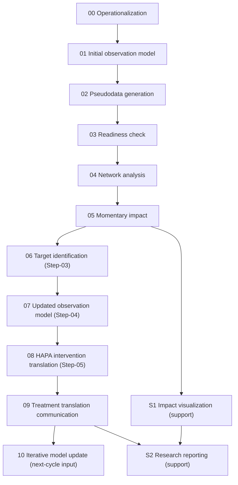

# Integrated Pipeline Orchestration

Standardized runner for PHOENIX stage execution on synthetic profiles.

## Entrypoints

- `run_pipeline.py`: mode-router and preferred integration entry.
- `run_engine_pipeline.py`: detailed integrated driver.
- `stages/`: explicit stage registry + final treatment-communication stage script.

## Stage Flow



Core PHOENIX loop ends at iterative model update.
Support stages are tracked separately in `quality_and_research_flow`.

## Readiness-Aligned Method Policy

- Tier3 + `TIME_VARYING_gVAR`: tv-gVAR + stationary gVAR + baseline.
- Tier3 + `STATIC_gVAR`: stationary gVAR + baseline.
- Tier2: reduced baseline set.
- Tier1: correlation-first baseline.
- Tier0: descriptive outputs only.

`FullyReady` is reserved for profiles where full tv-gVAR is executable.

## Iterative Closed Loop

When iterative memory is enabled (`--cycles > 1`), each cycle builds `_iterative_cycle_input/` from prior outputs:
- Step-04 updated predictor/criterion selection,
- Step-05 selected treatment targets,
- impact/ranking evidence.

The next cycle starts from pseudodata (`--start-from-pseudodata`) and reruns readiness onward on this cycle-specific dataset.
For traceability, iterative cycles still populate `00/01/02` with skip manifests and run-local pseudodata mirrors.
`run_pipeline.py --cycles N` automatically applies `--start-from-pseudodata` from cycle 2 onward.

## Visualization Default

- `run_engine_pipeline.py` defaults to `--no-run-impact-visualizations`.
- Enable support visuals explicitly with `--run-impact-visualizations`.

## LLM Startup Health Check

- By default, `run_engine_pipeline.py` performs a startup LLM probe before LLM-enabled stages.
- The probe result is written to `<run_root>/llm_startup_health_check.json`.
- Disable probe:

```bash
python evaluation/integrated_pipeline/run_engine_pipeline.py --no-startup-llm-health-check
```

- Fail fast when probe fails:

```bash
python evaluation/integrated_pipeline/run_engine_pipeline.py --fail-on-llm-health-check
```

## Quick Commands

```bash
python evaluation/integrated_pipeline/run_pipeline.py --mode synthetic_v1
```

```bash
python evaluation/integrated_pipeline/run_pipeline.py --mode synthetic_v1 \
  --pattern pseudoprofile_FTC_ID002 --max-profiles 1 --network-boot 10
```

```bash
python evaluation/integrated_pipeline/run_pipeline.py --mode synthetic_v1 \
  --hard-ontology-constraint --handoff-critic-max-iterations 2 --intervention-critic-max-iterations 2
```

Force full downstream chain (Step-06/07/08) even when readiness is Tier2 by running all network methods:

```bash
python evaluation/integrated_pipeline/run_pipeline.py --mode synthetic_v1 \
  --network-execution-policy all_methods \
  --run-impact-visualizations
```

Launch interactive frontend:

```bash
python evaluation/integrated_pipeline/run_pipeline.py --ui
```

Deterministic fallback (disable LLM everywhere supported):

```bash
python evaluation/integrated_pipeline/run_pipeline.py --mode synthetic_v1 --disable-llm
```

Session-scoped override roots (for frontend-driven runs):

```bash
python evaluation/integrated_pipeline/run_engine_pipeline.py \
  --pseudodata-root "<session>/outputs/pseudodata" \
  --initial-model-runs-root "<session>/outputs/initial_model/runs" \
  --free-text-root "<session>/inputs/free_text" \
  --pattern "pseudoprofile_FTC_ID901" \
  --max-profiles 1
```
