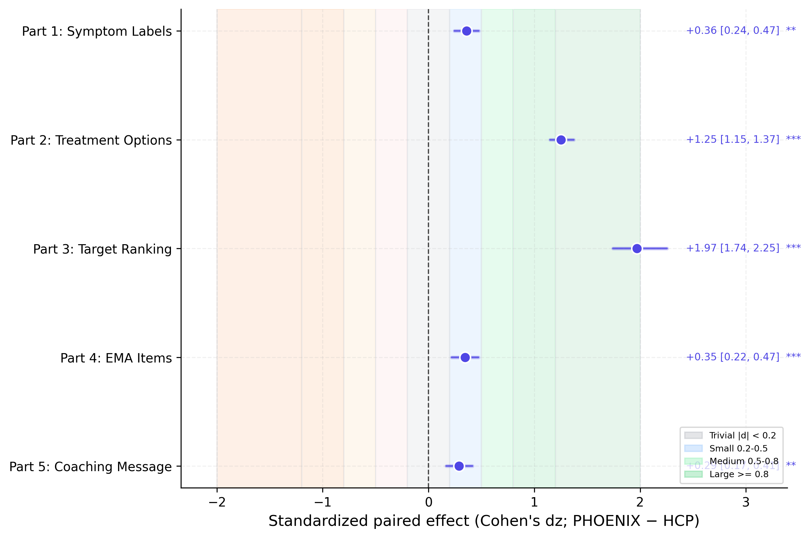
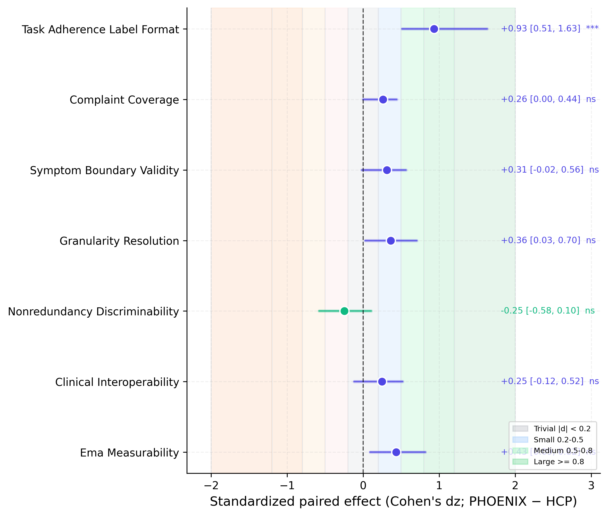
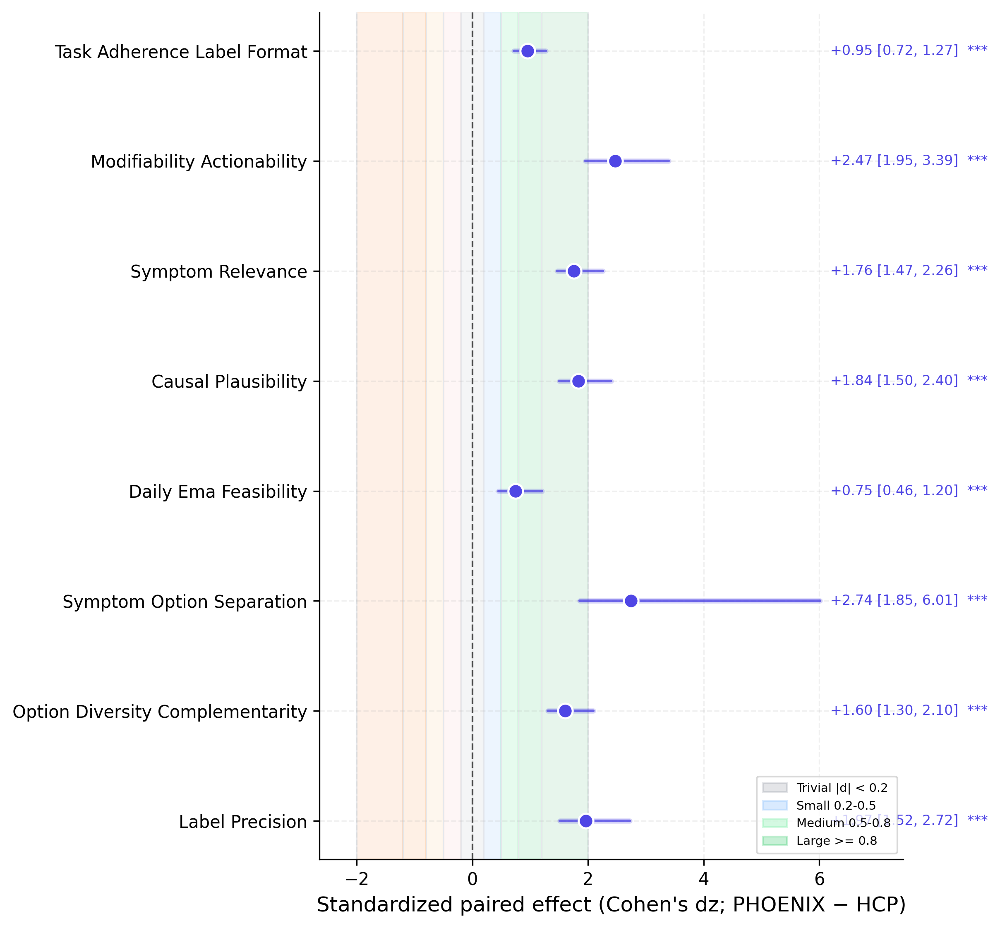
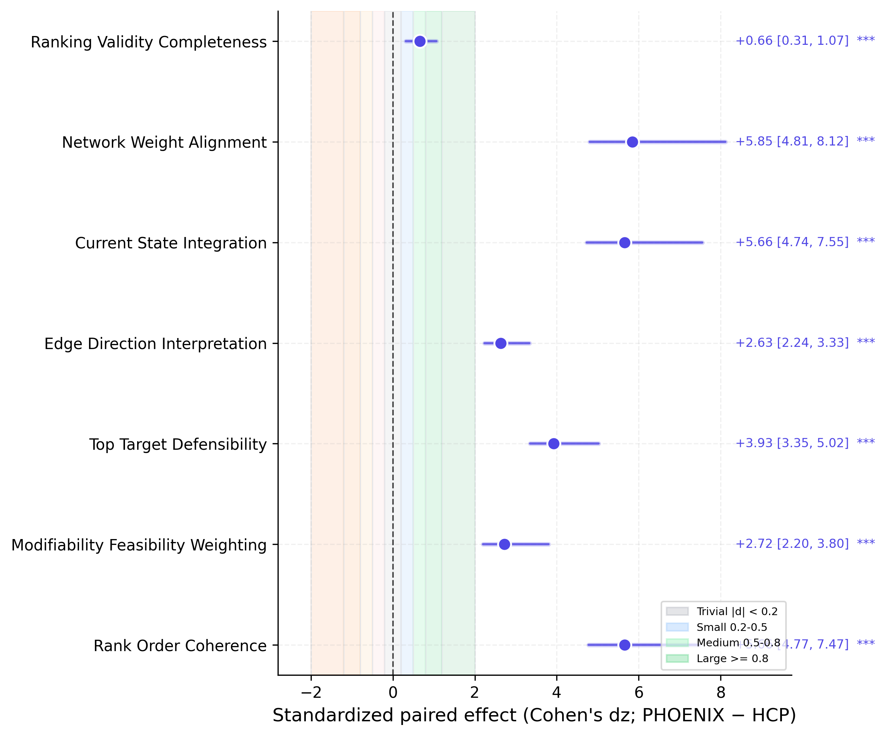
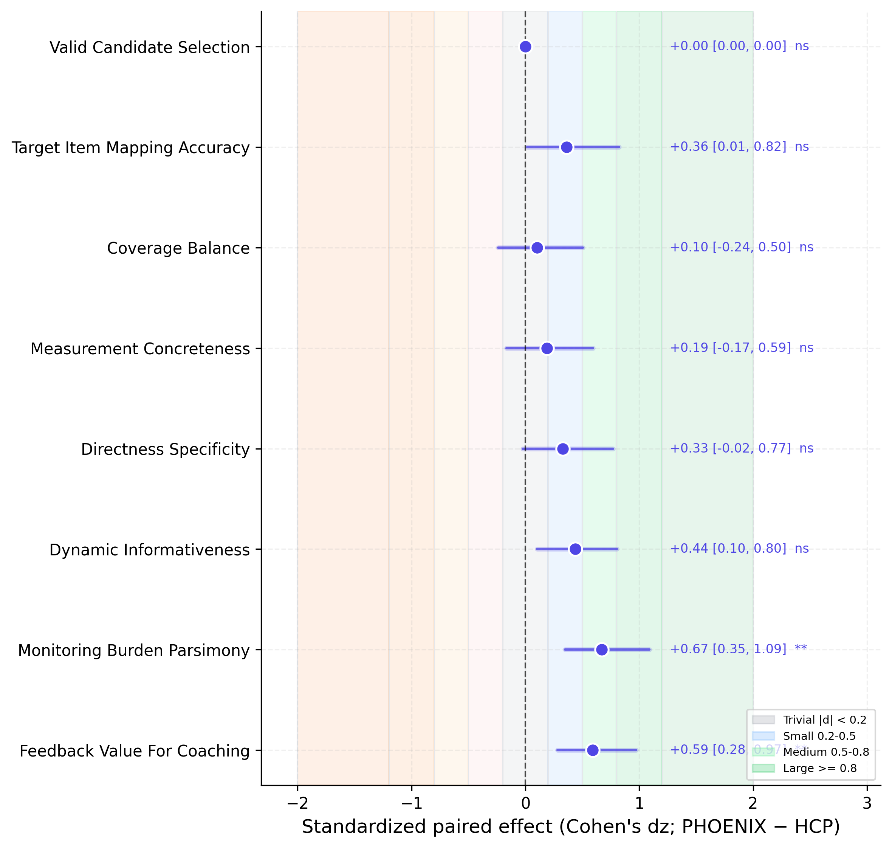
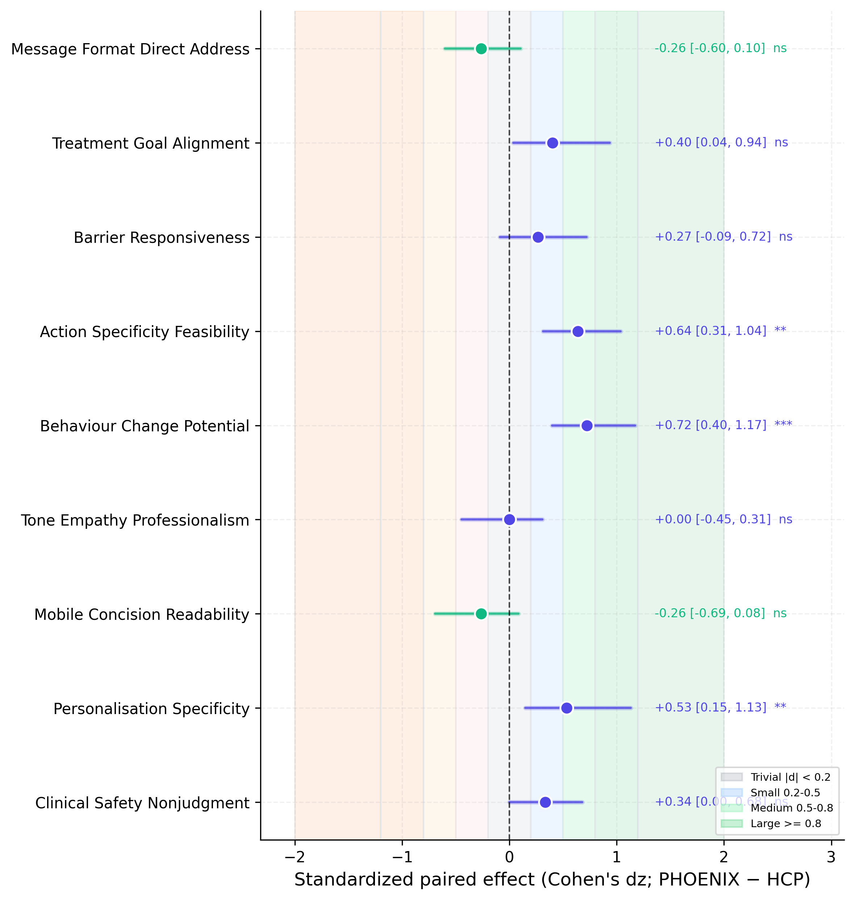
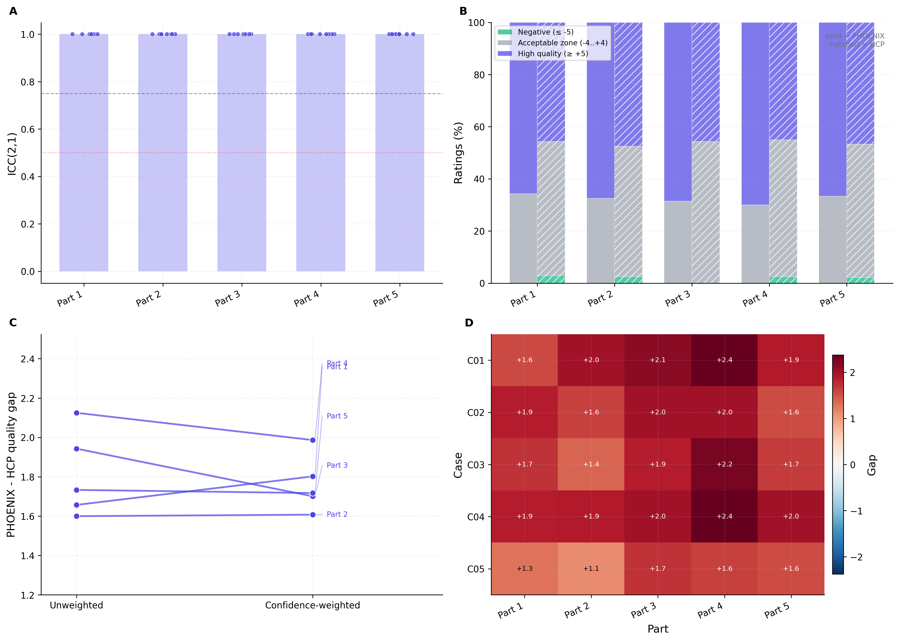

# PHOENIX Engine Evaluation Results

This document summarises the current PHOENIX engine evaluation run as a
research-paper results section. The present run is a software-validation run:
it uses LLM-generated pseudo HCP outputs and a real OpenRouter LLM judge to
validate the complete double-blind judging, mixed-model analysis, and reporting
workflow before the final Qualtrics HCP dataset is complete.

## Evaluation Sample

The evaluation covered 10 clinical cases across the five Qualtrics-matched
tasks: symptom-label generation, modifiable treatment-option generation,
treatment-target ranking, EMA item selection, and mobile coaching-message
generation. Each anonymous output was rated independently on a bipolar −10 to
+10 absolute quality scale across part-specific clinical and methodological
dimensions. Three independent judge runs were used per case, part, and source,
producing 2,340 long-format ratings.

| Component | Value |
| --- | ---: |
| Clinical cases | 10 |
| Survey parts | 5 |
| Evaluation dimensions | 39 configured, 38 unique dimension keys |
| Judge runs per source output | 3 |
| OpenRouter judge calls | 300 |
| Long-format ratings | 2,340 |
| Paired PHOENIX-HCP cells | 1,170 |
| Quality scale | −10 to +10 integer scale, 0 = acceptable |
| Raw PHOENIX-HCP gap range | −20 to +20 quality points |
| Standardized effect | Paired Cohen's dz on PHOENIX-HCP differences |
| Primary model | `quality_score ~ entity_ec + (1 \| case_id) + (1 \| judge_run)` |
| Equivalence margin | ±1.5 quality points |

## Primary Outcome

Across all parts and dimensions, PHOENIX was rated higher than the HCP
comparator. The pooled mixed-effects model estimated a raw PHOENIX-HCP quality
gap of Δ = +3.68 points, 95% CI [+3.35, +4.01], p < .001. Because each source
is rated on a −10 to +10 scale, raw between-source gaps can range from −20 to
+20 and should not be interpreted as standardized effects. The standardized
paired effect was medium, dz = +0.69, 95% CI [+0.64, +0.74]. The global TOST
analysis did not support practical equivalence, p<sub>TOST</sub> = 1.000,
because the observed effect exceeded the predefined equivalence band in favour
of PHOENIX.

<p align="center">
  
</p>

**Figure 1. Cross-part PHOENIX versus HCP quality effects.** Points show
raw mixed-model PHOENIX-HCP quality-point gaps with 95% confidence intervals.
Positive values favour PHOENIX. **Note.** Entity was effect coded as PHOENIX =
+0.5 and HCP = −0.5; per-part p-values are Holm corrected. The blue band marks
the ±1.5-point equivalence interval.

<p align="center">
  
</p>

**Figure 1B. Standardized cross-part PHOENIX versus HCP effects.** Points show
paired Cohen's dz with bootstrap 95% confidence intervals. **Note.**
Conventional bands indicate trivial, small, medium, and large standardized
effects. This panel should be used when comparing effect magnitude across
parts.

## Part-Level Effects

PHOENIX showed positive estimated effects in all five survey parts. The largest
advantage was observed for network-informed treatment-target ranking, followed
by modifiable treatment-option generation. Symptom labels and coaching messages
showed smaller but still positive effects; symptom labels were statistically
higher for PHOENIX while remaining practically equivalent within the ±1.5-point
margin.

| Part | PHOENIX M | HCP M | Raw gap | Cohen's dz | 95% CI for dz | Holm p | TOST |
| --- | ---: | ---: | ---: | ---: | --- | ---: | --- |
| Symptom labels | +4.41 | +3.61 | +0.80 | +0.36 | [+0.24, +0.47] | .0037 | Equivalent |
| Treatment options | +6.16 | −0.14 | +6.30 | +1.25 | [+1.15, +1.37] | < .001 | Not equivalent |
| Target ranking | +8.19 | −1.41 | +9.60 | +1.97 | [+1.74, +2.25] | < .001 | Not equivalent |
| EMA items | +6.33 | +5.07 | +1.27 | +0.35 | [+0.22, +0.47] | < .001 | Not equivalent |
| Coaching message | +4.01 | +2.87 | +1.14 | +0.29 | [+0.17, +0.41] | .0037 | Not equivalent |

<p align="center">
  
</p>

**Figure 2. Dimension-level PHOENIX-HCP quality gaps.** Heatmap cells show
raw mean quality-point gaps by survey part and evaluation dimension. **Note.**
Warm positive cells indicate dimensions where PHOENIX was rated higher; cooler
cells indicate dimensions where HCP was rated higher. Cell values are raw
differences, not standardized effects.

<p align="center">
  
</p>

**Figure 3. Quality score distributions by source and survey part.** Raincloud
plots show the full distribution of judge ratings for PHOENIX and HCP outputs.
**Note.** The dashed reference line at 0 marks the acceptable-quality baseline.

<p align="center">
  
</p>

**Figure 4. Equivalence-test summary.** The TOST panels evaluate whether
PHOENIX and HCP outputs fall inside the predefined ±1.5-point equivalence
margin. **Note.** Non-equivalence in Parts 2, 3, 4, and 5 reflects positive
PHOENIX effects outside the equivalence band, not HCP superiority.

## Dimension-Level Results

Part 1 showed a modest PHOENIX advantage. The clearest dimension-level gain was
task adherence and label format, raw Δ = +2.67, dz = +0.93, Holm p < .001.
Other symptom-label dimensions were small and mostly equivalent, indicating
that the optimised PHOENIX labels were concise and clinically usable without
over-expanding beyond the requested label-only format.

Part 2 showed the strongest improvement in clinical construct validity.
PHOENIX outperformed HCP especially on symptom-option separation,
raw Δ = +13.43, dz = +2.74; modifiability and actionability, raw Δ = +9.83,
dz = +2.47; causal plausibility, raw Δ = +7.73, dz = +1.84; option diversity,
raw Δ = +5.80, dz = +1.60; symptom relevance, raw Δ = +5.53, dz = +1.76;
label precision, raw Δ = +4.00, dz = +1.97; and daily EMA feasibility,
raw Δ = +2.07, dz = +0.75. This indicates that the PHOENIX treatment-option
set was judged as genuinely modifiable rather than merely re-labelling symptoms
as treatment targets.

Part 3 showed the largest PHOENIX advantage after adding numeric pseudo-network
context to the validation data. PHOENIX strongly outperformed HCP on
network-weight alignment, raw Δ = +13.73, dz = +5.85; current-state
integration, raw Δ = +13.30, dz = +5.66; rank-order coherence, raw Δ = +12.40,
dz = +5.66; top-target defensibility, raw Δ = +12.17, dz = +3.93; edge
direction interpretation, raw Δ = +7.33, dz = +2.63; and
modifiability-feasibility weighting, raw Δ = +6.47, dz = +2.72. These very
large standardized effects reflect a fixture where PHOENIX receives explicit
network evidence and the pseudo-HCP comparator often does not recover that
priority structure; this should be interpreted as a validation stress test, not
as the expected final HCP effect size.

Part 4 showed a smaller but consistent PHOENIX advantage. The largest gains
were observed for feedback value for coaching, raw Δ = +2.33, dz = +0.75;
monitoring burden and parsimony, raw Δ = +2.13, dz = +0.79; directness and
specificity, raw Δ = +1.93, dz = +0.33; target-item mapping accuracy,
raw Δ = +1.47, dz = +0.36; and dynamic informativeness, raw Δ = +1.40,
dz = +0.49. Both sources achieved perfect valid-candidate selection,
confirming that the candidate-list contract is functioning.

Part 5 showed a positive PHOENIX effect while preserving phone-ready tone.
The strongest standardized gains were behaviour-change potential,
raw Δ = +2.70, dz = +0.72; action specificity, raw Δ = +0.93, dz = +0.64;
personalisation specificity, raw Δ = +2.47, dz = +0.44; treatment-goal
alignment, raw Δ = +2.27, dz = +0.40; and barrier responsiveness,
raw Δ = +2.00, dz = +0.27. HCP remained similar on tone and concision,
indicating that PHOENIX's advantage came from clinical targeting and
behaviour-change structure rather than simply longer or more technical
messages.

<p align="center">
  
</p>

**Figure 5A. Part 1 standardized symptom-label dimension effects.** Effects
are paired Cohen's dz values with bootstrap 95% confidence intervals.

<p align="center">
  
</p>

**Figure 5B. Part 2 standardized treatment-option dimension effects.** The
largest standardized gains occurred on dimensions testing whether outputs were
genuinely modifiable, clinically causal, and distinct from symptom labels.

<p align="center">
  
</p>

**Figure 5C. Part 3 standardized treatment-target ranking dimension effects.**
The largest standardized gains occurred on network alignment, current-state
integration, and rank-order coherence.

<p align="center">
  
</p>

**Figure 5D. Part 4 standardized EMA item-selection dimension effects.**
PHOENIX showed its clearest standardized advantages on clinically useful
monitoring value and parsimony while matching HCP on valid-candidate selection.

<p align="center">
  
</p>

**Figure 5E. Part 5 standardized mobile coaching-message dimension effects.**
PHOENIX gains were concentrated in personalisation, treatment-goal alignment,
and expected behaviour-change value.

## Supplementary Reliability and Sensitivity

The three-run design showed adequate judge stability for a software-validation
run. Global mean ICC(2,1) was 0.684 across all part × dimension strata.
Reliability was highest for target ranking, ICC = 0.920, and treatment options,
ICC = 0.823. The lower Part 1 ICC, ICC = 0.484, reflects smaller between-source
effects and greater stochastic variation around otherwise acceptable symptom
labels. Confidence-weighted sensitivity analyses changed part-level effects by
at most 0.097 quality points, indicating that the primary conclusions were not
driven by low-confidence ratings.

| Supplementary diagnostic | Value |
| --- | ---: |
| Global mean ICC(2,1) | 0.684 |
| Highest part-level ICC | Part 3 = 0.920 |
| Lowest part-level ICC | Part 1 = 0.484 |
| Maximum confidence-weighted shift | 0.097 points |
| Grand mean case × part gap | +3.82 |
| Case × part cells with positive PHOENIX gap | 44 / 50 |

<p align="center">
  
</p>

**Figure 6. Supplementary evaluation diagnostics.** Panel A shows judge-run
ICC(2,1) by part with dimension-level points. Panel B shows scale-use bands for
PHOENIX and HCP outputs. Panel C compares unweighted and confidence-weighted
PHOENIX-HCP gaps. Panel D shows case-by-part heterogeneity. **Note.** Figure
content is title-free by design; figure interpretation is provided in the
caption text.

<p align="center">
  
</p>

**Figure 7. Score calibration diagnostics.** The calibration plot verifies that
the judge used the bipolar scale rather than collapsing all ratings near zero.
**Note.** PHOENIX showed high-quality-range compression in Part 3, consistent
with near-optimal recovery of the supplied pseudo-network priority structure.

## Statistical Conclusion

This validation run supports the full PHOENIX double-blind evaluation workflow.
The current PHOENIX output artifact outperformed the HCP comparator globally
and in every survey part under real LLM judging. On the standardized scale, the
largest advantages were observed in tasks where structured computational
reasoning is central: constructing modifiable treatment options and ranking
treatment targets from network and EMA evidence. Smaller but positive
standardized effects were observed for symptom labels, EMA item selection, and
mobile coaching messages. Supplementary analyses showed that the three-run
judge design was stable and that conclusions were robust to confidence
weighting.

The present estimates should be interpreted as software-validation results,
not final thesis findings. Final inference should be rerun after the complete
Qualtrics HCP dataset and production PHOENIX outputs are available.

## Reproduction

The current run was generated with:

```bash
set -a; source .env; set +a
rm -f evaluation/survey_analysis/data/04_judgments/judgments_long.csv
rm -rf evaluation/survey_analysis/data/04_judgments/raw
python3 evaluation/survey_analysis/pipeline.py \
  --mode pseudo \
  --judge openrouter \
  --n-runs 3 \
  --log-level INFO
```
