# PHOENIX Engine Evaluation Results

This document summarizes the current PHOENIX engine evaluation run as a
research-paper results section. The present run is a software-validation run:
it uses pseudo HCP outputs and the pseudo judge to validate the full data flow,
model formulas, figures, and reporting layer before the final Qualtrics HCP
dataset is complete.

## Evaluation Sample

The evaluation covered 10 clinical cases across the five Qualtrics-matched
tasks: symptom-label generation, modifiable treatment-option generation,
treatment-target ranking, EMA item selection, and mobile coaching-message
generation. Each anonymous source output was rated on a 1 to 5 absolute quality
scale across part-specific clinical and methodological dimensions. Three
independent judge runs were used per case, part, and source, producing 2,340
long-format ratings.

| Component | Value |
| --- | ---: |
| Clinical cases | 10 |
| Survey parts | 5 |
| Evaluation dimensions | 39 |
| Judge runs per cell | 3 |
| Long-format ratings | 2,340 |
| Paired PHOENIX-HCP cells | 1,170 |
| Primary model | `quality_score ~ entity_ec + (1 | case_id) + (1 | judge_run)` |
| Equivalence margin | +/-0.3 quality points |

## Primary Outcome

Across all parts and dimensions, PHOENIX achieved higher quality ratings than
the HCP comparator in this validation run, with a pooled mixed-model estimate
of +0.3385 quality points, 95% CI [+0.2906, +0.3863], p < .001. The global TOST
test did not support practical equivalence, observed difference = +0.3385,
p<sub>TOST</sub> = .9954, because the observed effect exceeded the predefined
equivalence band in favour of PHOENIX.

<p align="center">
  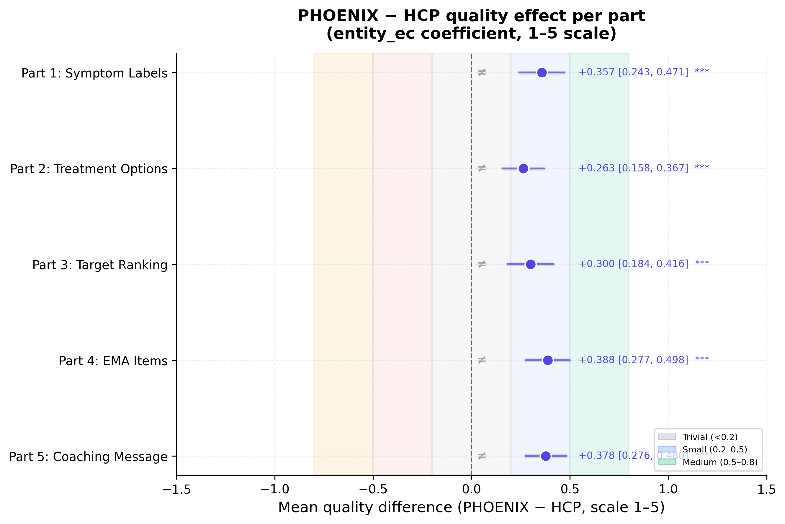
</p>

**Figure 1. Cross-part PHOENIX versus HCP quality effects.** Points show
mixed-model PHOENIX-HCP quality gaps on the 1 to 5 scale, with 95% confidence
intervals. Positive values favour PHOENIX. **Note.** Entity was effect coded as
PHOENIX = +0.5 and HCP = -0.5; p-values are Holm corrected for the per-part
follow-up tests.

## Part-Level Effects

PHOENIX showed positive estimated effects in all five parts. The strongest
part-level effect was observed for EMA item selection, followed by mobile
coaching messages, symptom labels, target ranking, and treatment-option labels.
All part-level effects were statistically significant after Holm correction.

| Part | PHOENIX M | HCP M | PHOENIX-HCP gap | 95% CI | Holm p | TOST |
| --- | ---: | ---: | ---: | --- | ---: | --- |
| Symptom labels | 4.157 | 3.800 | +0.3571 | [+0.2430, +0.4713] | < .001 | Not equivalent |
| Treatment options | 4.125 | 3.862 | +0.2625 | [+0.1576, +0.3674] | < .001 | Not equivalent |
| Target ranking | 4.143 | 3.843 | +0.3000 | [+0.1842, +0.4158] | < .001 | Not equivalent |
| EMA items | 4.213 | 3.825 | +0.3875 | [+0.2770, +0.4980] | < .001 | Not equivalent |
| Coaching message | 4.211 | 3.833 | +0.3778 | [+0.2757, +0.4799] | < .001 | Not equivalent |

<p align="center">
  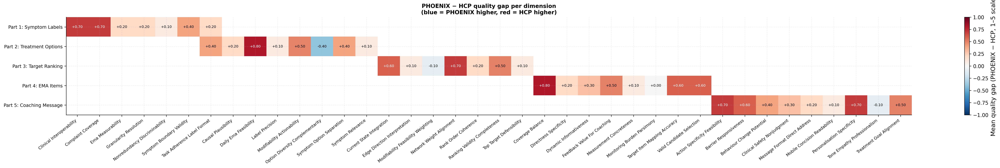
</p>

**Figure 2. Dimension-level PHOENIX-HCP quality gaps.** Heatmap cells show
estimated PHOENIX-HCP quality gaps by survey part and evaluation dimension.
Warmer positive cells indicate dimensions where PHOENIX was rated higher.
**Note.** Dimension-level estimates are intended to identify where performance
differs, not to replace the primary mixed-model inference.

<p align="center">
  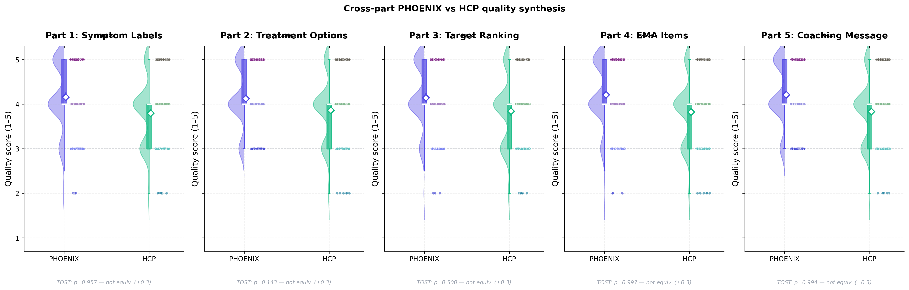
</p>

**Figure 3. Quality score distributions by source and survey part.** Raincloud
plots show the distribution of 1 to 5 quality ratings for PHOENIX and HCP
outputs within each survey part. **Note.** The plots expose both distributional
overlap and mean separation, which is important because ceiling compression can
occur on easier structured tasks.

<p align="center">
  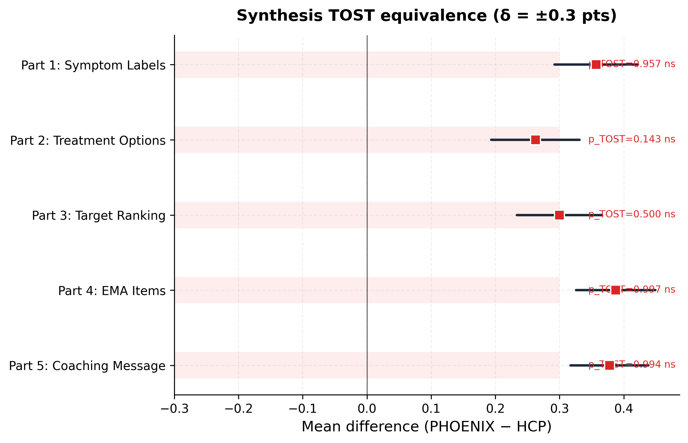
</p>

**Figure 4. Equivalence-test summary.** TOST panels evaluate whether PHOENIX
and HCP outputs fall inside the predefined +/-0.3 quality-point equivalence
margin. **Note.** Non-equivalence in this validation run reflects positive
PHOENIX effects outside the equivalence band rather than underperformance.

## Dimension-Level Interpretation

The effect pattern was not uniform across dimensions. Part 2 showed its
largest PHOENIX gains on daily EMA feasibility (+0.800), modifiability and
actionability (+0.500), task adherence (+0.400), and label precision (+0.400),
while option diversity and complementarity favoured the HCP comparator
(-0.400). Part 3 showed the clearest PHOENIX advantages on network-weight
alignment (+0.700), current-state integration (+0.600), and ranking validity
(+0.500). Part 4 showed robust PHOENIX gains on valid candidate selection,
target-item mapping, and coverage balance. Part 5 showed positive effects on
barrier responsiveness, action specificity, treatment-goal alignment, and
personalisation, with minimal differences on mobile concision and tone.

<p align="center">
  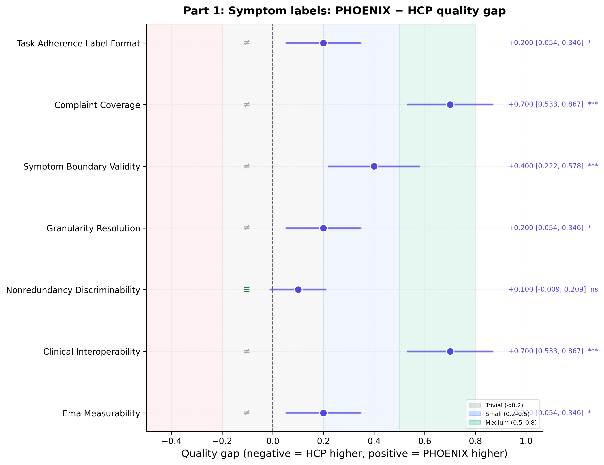
</p>

**Figure 5A. Part 1 symptom-label dimension effects.** PHOENIX showed positive
effects on complaint coverage, symptom-boundary validity, task adherence,
granularity, clinical interoperability, and EMA measurability. **Note.** Effects
are PHOENIX-HCP quality gaps with 95% confidence intervals.

<p align="center">
  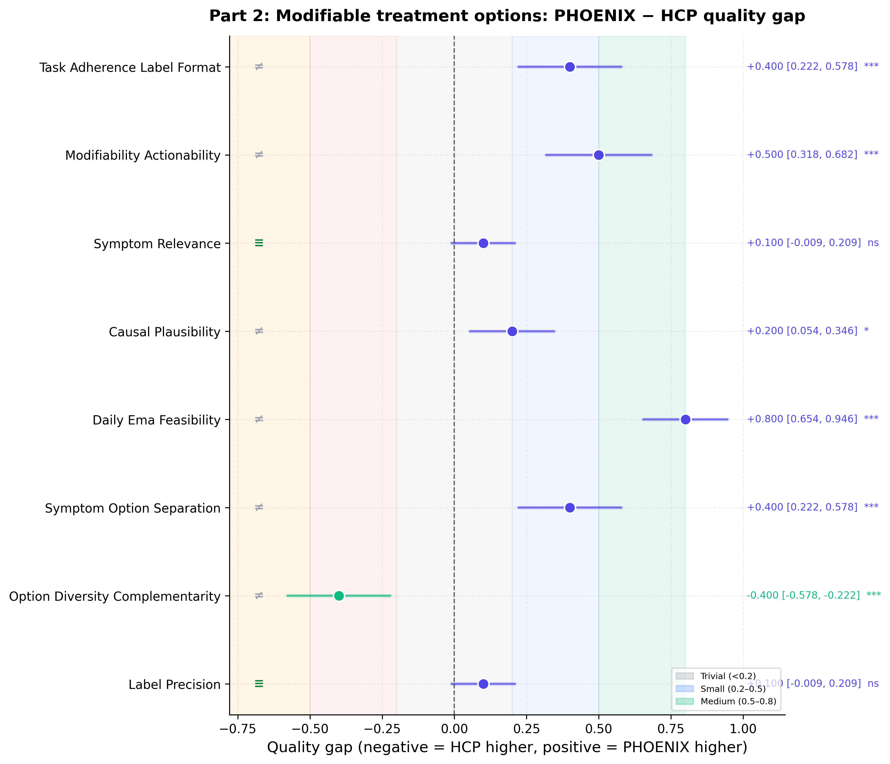
</p>

**Figure 5B. Part 2 treatment-option dimension effects.** PHOENIX was rated
higher on structured, EMA-compatible treatment-option criteria, while option
diversity and complementarity favoured the HCP comparator. **Note.** This
pattern is consistent with stronger rule adherence but reduced conceptual
diversity in the PHOENIX output set.

<p align="center">
  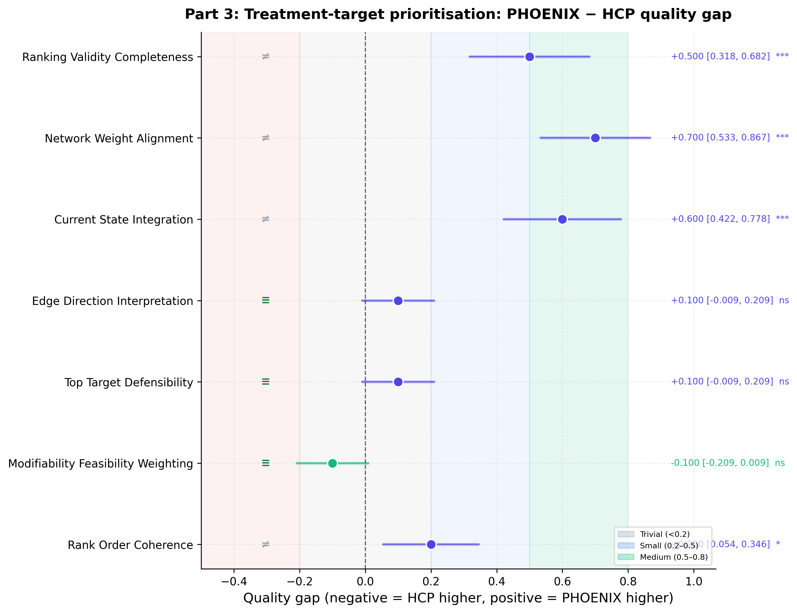
</p>

**Figure 5C. Part 3 treatment-target ranking dimension effects.** PHOENIX
showed its clearest advantages on network alignment and current-state
integration. **Note.** This is the task where explicit network weights and EMA
burden summaries are most central to performance.

<p align="center">
  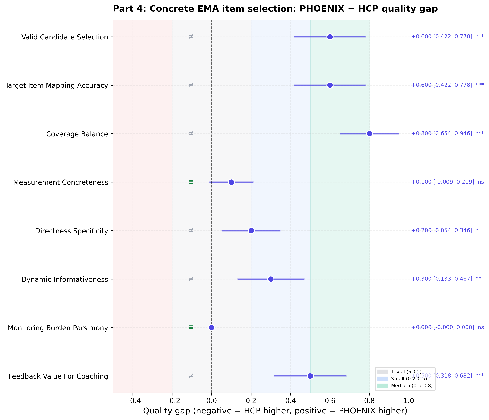
</p>

**Figure 5D. Part 4 EMA item-selection dimension effects.** PHOENIX showed
positive gaps on candidate validity, target-item mapping, coverage balance,
directness, burden, and coaching-feedback value. **Note.** The task is highly
constrained because outputs must be selected from a fixed candidate item list.

<p align="center">
  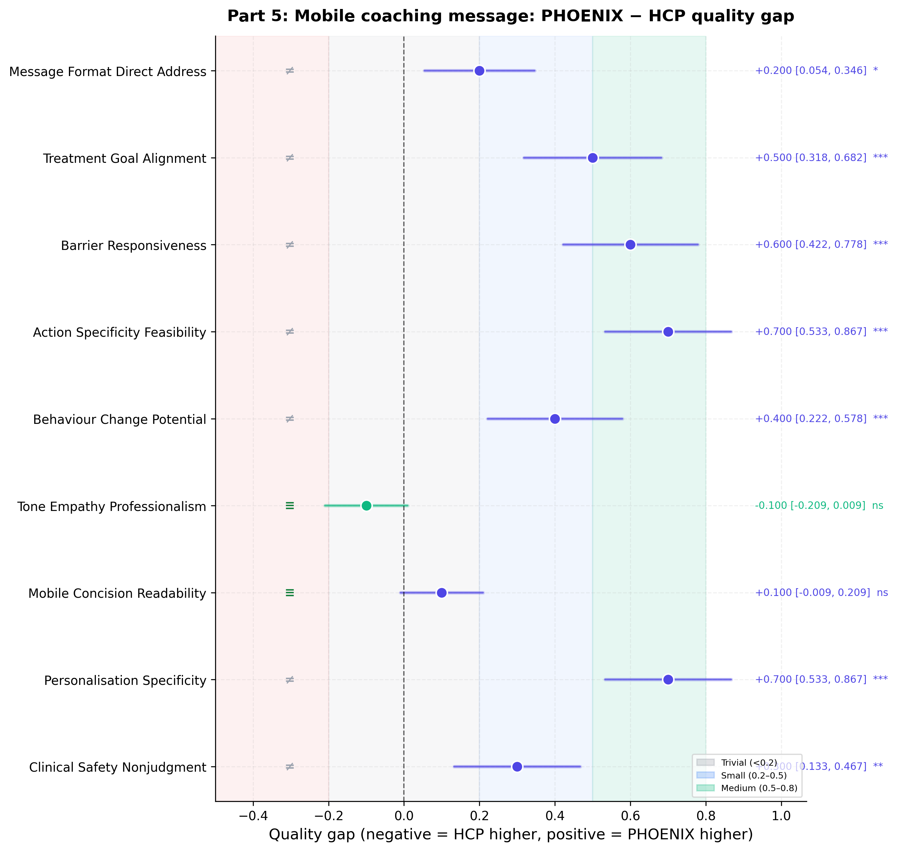
</p>

**Figure 5E. Part 5 mobile coaching-message dimension effects.** PHOENIX
showed positive effects on treatment-goal alignment, barrier responsiveness,
action specificity, behaviour-change potential, personalisation, and clinical
safety. **Note.** This part evaluates the transition from technical treatment
selection to patient-facing behaviour-change communication.

## Supplementary Reliability and Sensitivity

The three-run design was evaluated with supplementary stability diagnostics.
In pseudo-judge validation mode, ratings are deterministic for a fixed cell,
which produces near-perfect run-level stability. In the final OpenRouter judge
run, these same analyses quantify stochastic judge variability.

| Stability metric | Value |
| --- | ---: |
| Mean within-cell rating SD | 0.000 |
| Mean within-cell PHOENIX-HCP gap SD | 0.000 |
| Mean directional consistency | 1.000 |
| Maximum confidence-weighted change | 0.092 |

<p align="center">
  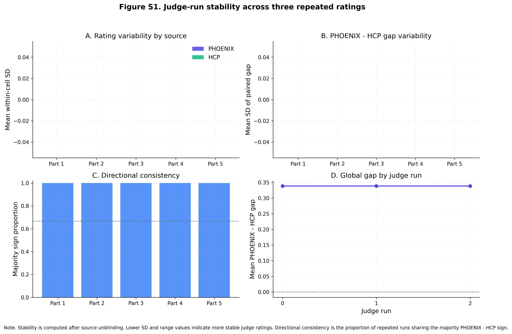
</p>

**Figure 6. Judge-run stability across three repeated ratings.** Panels show
rating variability, PHOENIX-HCP gap variability, directional consistency, and
run-level global gaps. **Note.** Lower within-cell SD and higher sign
consistency indicate more stable judge behaviour.

<p align="center">
  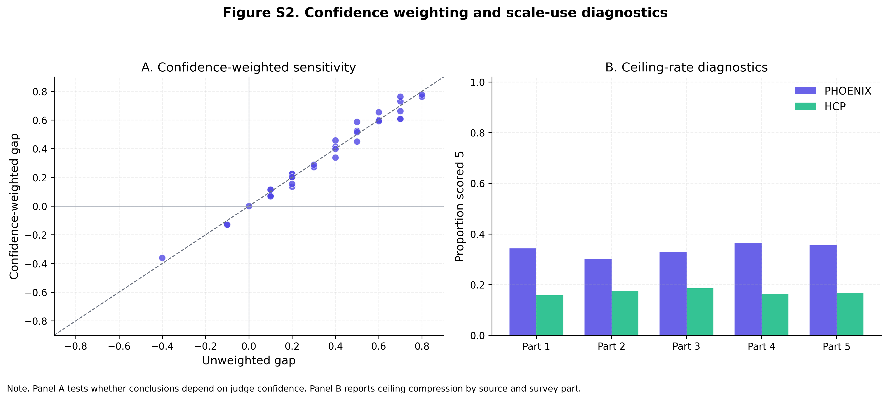
</p>

**Figure 7. Confidence-weighted sensitivity and scale-use diagnostics.** The
left panel compares unweighted PHOENIX-HCP gaps with confidence-weighted gaps.
The right panel shows ceiling rates by source and part. **Note.** The maximum
confidence-weighted shift was 0.092 quality points, indicating that conclusions
were not materially changed by judge confidence weighting in this validation
run.

<p align="center">
  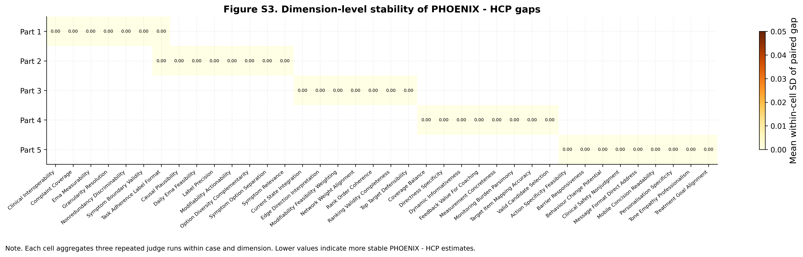
</p>

**Figure 8. Dimension-level stability of PHOENIX-HCP gaps.** Cells show
within-cell SD of the paired PHOENIX-HCP gap across repeated judge runs.
**Note.** This diagnostic is primarily intended for the final stochastic
OpenRouter judge run, where run-to-run variation is expected.

## Statistical Conclusion

The validation run confirms that the revised evaluation pipeline can recover
source-level PHOENIX-HCP effects, produce interpretable part-specific and
dimension-specific estimates, quantify practical equivalence, and report
supplementary stability diagnostics. The current results should be interpreted
as a pipeline validation, not as the final empirical comparison against the
incoming Qualtrics HCP responses.

## Reproduction

```bash
python evaluation/survey_analysis/pipeline.py --mode pseudo --n-runs 3
```

For the final real-data run, replace pseudo HCP outputs with the completed
Qualtrics export, prepare the PHOENIX outputs under `evaluation/phoenix_outputs`,
and run:

```bash
python evaluation/survey_analysis/pipeline.py --mode real --judge openrouter --n-runs 3
```
