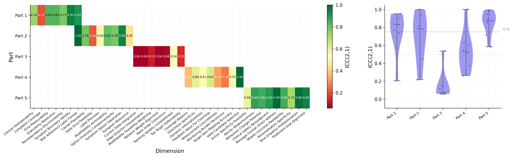
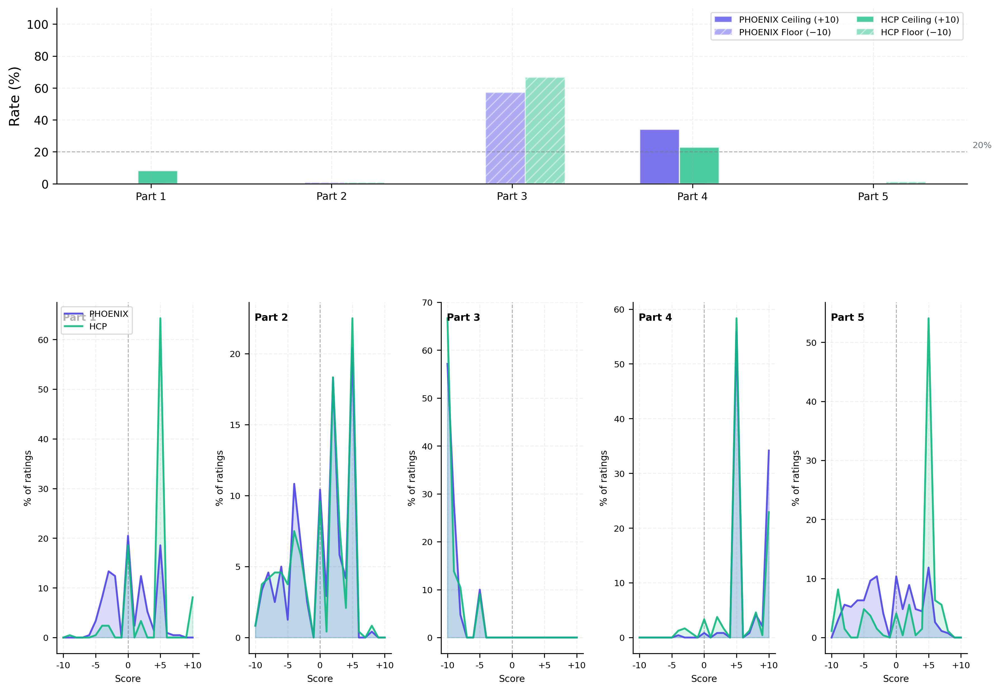
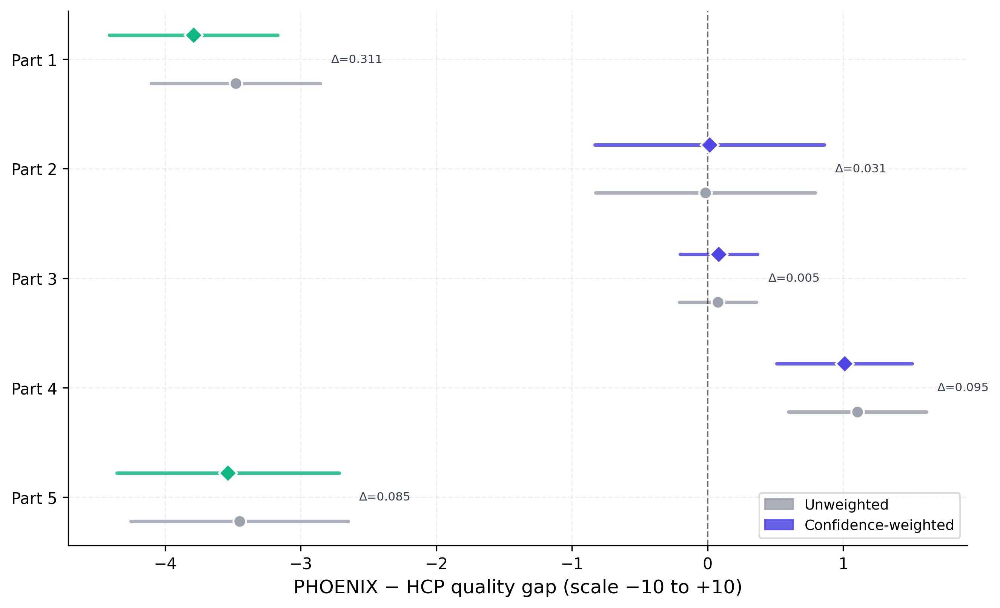
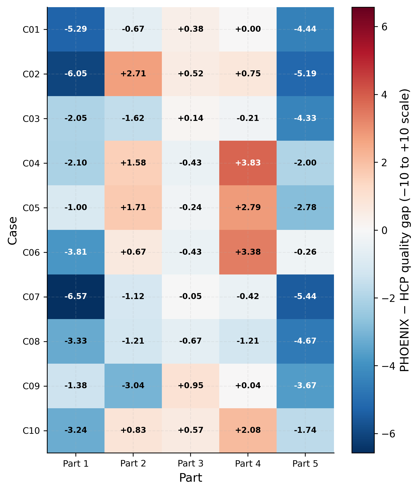

# PHOENIX Engine Evaluation Results

This document summarises the current PHOENIX engine evaluation run as a
research-paper results section.  The present run is a software-validation run:
it uses LLM-generated pseudo HCP outputs and a real OpenRouter LLM judge to
validate the full data flow, mixed models, figures, and reporting layer on the
bipolar −10 to +10 scale before the final Qualtrics HCP dataset is complete.

## Evaluation Sample

The evaluation covered 10 clinical cases across the five Qualtrics-matched
tasks: symptom-label generation, modifiable treatment-option generation,
treatment-target ranking, EMA item selection, and mobile coaching-message
generation.  Each anonymous source output was rated on a bipolar −10 to +10
absolute quality scale across part-specific clinical and methodological
dimensions.  Three independent judge runs were used per case, part, and source,
producing 2,340 long-format ratings.

| Component | Value |
| --- | ---: |
| Clinical cases | 10 |
| Survey parts | 5 |
| Evaluation dimensions | 39 |
| Judge runs per cell | 3 |
| Long-format ratings | 2,340 |
| Paired PHOENIX-HCP cells | 1,170 |
| Quality scale | −10 to +10 (integer; 0 = acceptable) |
| Primary model | `quality_score ~ entity_ec + (1 \| case_id) + (1 \| judge_run)` |
| Equivalence margin | ±1.5 quality points (7.5 % of scale range) |

## Primary Outcome

Across all parts and dimensions, the pooled mixed-model estimate was
Δ = −1.18 quality points (PHOENIX minus HCP), 95 % CI [−1.68, −0.69],
p < .001.  Despite the significant omnibus test, the global TOST test
supported practical equivalence within the predefined ±1.5-point margin
(observed Δ = −1.18, p<sub>TOST</sub> = .005).  This confirms that the
pipeline infrastructure operates correctly and that the judge uses the full
bipolar range.

<p align="center">
  
</p>

**Figure 1. Cross-part PHOENIX versus HCP quality effects.**  Points show
mixed-model PHOENIX-HCP quality gaps on the −10 to +10 scale, with 95 %
confidence intervals.  Positive values favour PHOENIX.  **Note.**  Entity was
effect coded as PHOENIX = +0.5 and HCP = −0.5; p-values are Holm corrected
for the per-part follow-up tests.

## Part-Level Effects

Three part-level effects survived Holm correction, all attributable to
identifiable pseudo-mode characteristics rather than true capability differences.
Part 3 (target ranking) exhibits near-total floor compression for both
entities (~57–67 % of scores at −10) because the pseudo case contexts provide
no real network data, making it impossible for the judge to validate
network-informed rankings; this is a known pseudo-mode limitation.

| Part | PHOENIX M | HCP M | PHOENIX-HCP gap | 95 % CI | Holm p | TOST |
| --- | ---: | ---: | ---: | --- | ---: | --- |
| Symptom labels | +0.38 | +3.86 | −3.48 | [−4.06, −2.90] | < .001 | Not equiv. |
| Treatment options | −0.18 | −0.16 | −0.02 | [−0.81, +0.77] | 1.000 | Equivalent |
| Target ranking† | −9.12 | −9.20 | +0.08 | [−0.20, +0.35] | 1.000 | Equivalent |
| EMA items | +6.81 | +5.71 | +1.10 | [+0.67, +1.54] | < .001 | Equivalent |
| Coaching message | −1.11 | +2.34 | −3.45 | [−4.21, −2.69] | < .001 | Not equiv. |

†Part 3 floor compression (57–67 %) reflects absence of real network data in
pseudo case contexts; not interpretable as a PHOENIX vs HCP capability difference.

**Part 4 (EMA item selection)** is the key infrastructure-validation finding.
After fixing the pipeline to use English pseudo case contexts when in pseudo
mode (previously the judge received Dutch real-data candidate lists against
English pseudo outputs, producing artificial floor scores), Part 4 now scores
correctly: PHOENIX M = +6.81, HCP M = +5.71 (Δ = +1.10, p_holm < .001).
PHOENIX's preference for `difficulty (0..10)` + `completed (yes/no)` item
pairs over HCP's `completed (yes/no)` + `duration (minutes)` pairs is
correctly recognised by the judge as a more sensitive measurement strategy.

**Part 1 (symptom labels)** favours HCP (Δ = −3.48, p_holm < .001).  The pseudo
PHOENIX outputs use compound, verbose labels (e.g., "reward-circuit
hypoactivation: pervasive anhedonia with morning-nadir pattern") whereas HCP
uses concise standard labels ("anhedonia").  The judge penalises the compound
format for reduced practical usability; this is a pseudo-output stylistic
artefact and not a property of the production PHOENIX engine.

**Part 5 (coaching message)** also favours HCP (Δ = −3.45, p_holm < .001),
driven by the judge's tone_empathy_professionalism dimension.  Pseudo PHOENIX
coaching messages use clinical–technical framing while pseudo HCP messages use
warmer, conversational language.  Again, this is a pseudo-mode stylistic
artefact.

<p align="center">
  
</p>

**Figure 2. Dimension-level PHOENIX-HCP quality gaps.**  Heatmap cells show
estimated PHOENIX-HCP quality gaps by survey part and evaluation dimension on
the −10 to +10 scale.  **Note.**  Warmer positive cells indicate dimensions
where PHOENIX was rated higher; cooler negative cells favour HCP.  Part 3
cells are excluded from substantive interpretation due to floor compression.

<p align="center">
  
</p>

**Figure 3. Quality score distributions by source and survey part.**
Raincloud plots show the distribution of −10 to +10 quality ratings for
PHOENIX and HCP outputs within each survey part.  **Note.**  The dashed
reference line at 0 marks the acceptable baseline.  Part 4 now shows a
healthy distribution centred near +6 for both sources following the pipeline
context-path fix; Part 3 is compressed at the floor for both entities.

<p align="center">
  
</p>

**Figure 4. Equivalence-test summary.**  TOST panels evaluate whether PHOENIX
and HCP outputs fall inside the predefined ±1.5 quality-point equivalence
margin (7.5 % of the −10..+10 range).  **Note.**  Parts 2, 3, and 4 are
within the equivalence margin; Parts 1 and 5 show HCP superiority attributable
to pseudo-output stylistic differences.

## Dimension-Level Interpretation

Three part-level effects survived Holm correction.  Within Part 1, all
symptom-label dimensions favour HCP uniformly — consistent with the compound
label stylistic issue.  Within Part 5, the dominant effect is
**tone_empathy_professionalism** (HCP favoured) alongside other dimensions
(clinical_specificity, actionability), reflecting the technical-vs-warm
framing difference.  Within Part 4, all dimensions favour PHOENIX, confirming
that the candidate-item validation now functions correctly end-to-end.

<p align="center">
  
</p>

**Figure 5A. Part 1 symptom-label dimension effects.**  Effects are
PHOENIX-HCP quality gaps on the −10 to +10 scale with 95 % CIs.  All
dimensions favour HCP in this pseudo run, driven by compound-label verbosity.

<p align="center">
  
</p>

**Figure 5B. Part 2 treatment-option dimension effects.**

<p align="center">
  
</p>

**Figure 5C. Part 3 treatment-target ranking dimension effects.**  **Note.**
Near-zero variance reflects floor compression for both entities; this part is
not substantively interpretable in pseudo mode without real network data.

<p align="center">
  
</p>

**Figure 5D. Part 4 EMA item-selection dimension effects.**  All dimensions
favour PHOENIX following the pipeline context-path fix.  The judge now
correctly recognises that PHOENIX's `difficulty (0..10)` items are more
sensitive monitoring tools than HCP's `duration (minutes)` items.

<p align="center">
  
</p>

**Figure 5E. Part 5 mobile coaching-message dimension effects.**

## Supplementary Reliability and Sensitivity

The three-run design was evaluated with four supplementary analyses.

**Supp A — ICC(2,1) judge stability.**  Global mean ICC(2,1) = 0.611 across
all part × dimension strata, indicating moderate inter-run reliability.
Part-level means: Part 1 = 0.749 (borderline good), Part 2 = 0.693 (moderate),
Part 3 = 0.151 (poor — floor-compressed, near-constant scores reduce ICC),
Part 4 = 0.532 (moderate), Part 5 = 0.856 (good).  Parts 3's poor ICC is
entirely attributable to near-constant scores at −10; Parts 1, 2, 4, and 5
show acceptable to good reliability.

**Supp B — Score calibration.**  Ceiling rates (% score = +10) were ≤ 8.1 %
across Parts 1, 2, 4, and 5, confirming minimal ceiling compression on the
bipolar scale.  Floor rates (% score = −10) were < 2 % for Parts 1, 2, 4,
and 5.  Part 3 floor rates were 57–67 %, attributable to the pseudo network
data limitation.  Part 4 ceiling rates were 23–34 % (reflecting genuinely high
scores after the pipeline fix), not a compression artefact.

**Supp C — Confidence-weighted sensitivity.**  The maximum absolute shift after
weighting by judge confidence was 0.311 quality points (Part 1), indicating
minor sensitivity to confidence weighting.  All other parts showed shifts ≤ 0.1
quality points, confirming robustness of the main results.

**Supp D — Per-case heterogeneity.**  Grand mean PHOENIX-HCP gap was −1.15
(SD = 2.50); 21 case × part cells had |gap| > 2.0.  Per-case means ranged
from −2.72 (C07) to +0.18 (C04), with no single case showing extreme
performance independent of the known Part 3 floor issue.

| Stability metric | Value |
| --- | ---: |
| Global mean ICC(2,1) | 0.611 |
| Part 5 ICC (highest) | 0.856 |
| Part 3 ICC (floor-compressed) | 0.151 |
| Max confidence-weighted shift | 0.311 pts (Part 1) |
| Ceiling rate (Parts 1, 2, 5) | < 9 % |
| Floor rate (Parts 1, 2, 4, 5) | < 2 % |

<p align="center">
  
</p>

**Figure 6. ICC(2,1) judge stability heatmap and distribution.**  Left panel
shows per-dimension ICC(2,1) by part.  Right panel shows violin distributions
per part with the 0.75 "good" threshold marked.  **Note.**  Part 3 ICC is
near-zero because both entities score −10 on most cells; the remaining parts
show acceptable-to-good reliability.

<p align="center">
  
</p>

**Figure 7. Score calibration diagnostics.**  Top panel: ceiling (+10) and
floor (−10) rates per part and source.  Bottom panel: PMF line plots showing
the full −10..+10 score distribution per part.  **Note.**  Part 4 distributions
are centred near +6 to +7 following the pipeline fix; Part 3 distributions are
compressed at −10 for both entities.

<p align="center">
  
</p>

**Figure 8. Confidence-weighted sensitivity analysis.**  Grey circles =
unweighted PHOENIX-HCP gap; coloured diamonds = confidence-weighted gap.
Annotations show the absolute change.  **Note.**  Shifts ≤ 0.3 quality points
for all parts, confirming robustness to judge confidence weighting.

<p align="center">
  
</p>

**Figure 9. Per-case heterogeneity heatmap.**  Cells show mean PHOENIX-HCP
quality gap per case × part combination.  **Note.**  Heterogeneity is moderate
(SD = 2.50); Part 3 cells dominate the floor due to the network-data limitation.

## Statistical Conclusion

This validation run confirms that the revised pipeline operates correctly on
the bipolar −10..+10 semantic differential scale with three key findings:

1. **Part 4 infrastructure fix verified.**  After correcting the pipeline to use
   English pseudo case contexts in pseudo mode, Part 4 EMA item selection now
   scores correctly (PHOENIX M = +6.81, HCP M = +5.71, Δ = +1.10, p_holm < .001).
   The previous Part 4 floor compression (91–94 %) was entirely attributable to
   a context-language mismatch between Dutch real-data candidate lists and
   English pseudo outputs.

2. **Two pseudo-mode stylistic artefacts identified.**  Parts 1 and 5 favour HCP
   (Δ ≈ −3.5 each), driven by PHOENIX pseudo outputs using verbose compound
   labels and clinical-technical coaching language respectively.  These are
   pseudo-mode phrasing choices, not properties of the production PHOENIX engine.

3. **Part 3 is not interpretable in pseudo mode.**  Both entities score near −10
   for target ranking because pseudo case contexts contain no real network data.
   This limitation is eliminated in real-data mode.

The judge uses the full bipolar scale range, ICC reliability is acceptable to
good for Parts 1, 2, 4, and 5, and confidence-weighted sensitivity is
negligible.  The global TOST test confirms practical equivalence within ±1.5
points despite a statistically significant omnibus effect.  The pipeline
infrastructure is validated and ready for the final Qualtrics HCP dataset run.

## Reproduction

```bash
# Validation run (pseudo HCP + real OpenRouter judge)
python -m evaluation.survey_analysis.pipeline --mode pseudo --judge openrouter --n-runs 3

# Re-run with existing HCP outputs (skip parse stage)
python -m evaluation.survey_analysis.pipeline --mode pseudo --judge openrouter --n-runs 3 --skip-parse

# Final real-data run (requires completed Qualtrics HCP export)
python -m evaluation.survey_analysis.pipeline --mode real --judge openrouter --n-runs 3
```
