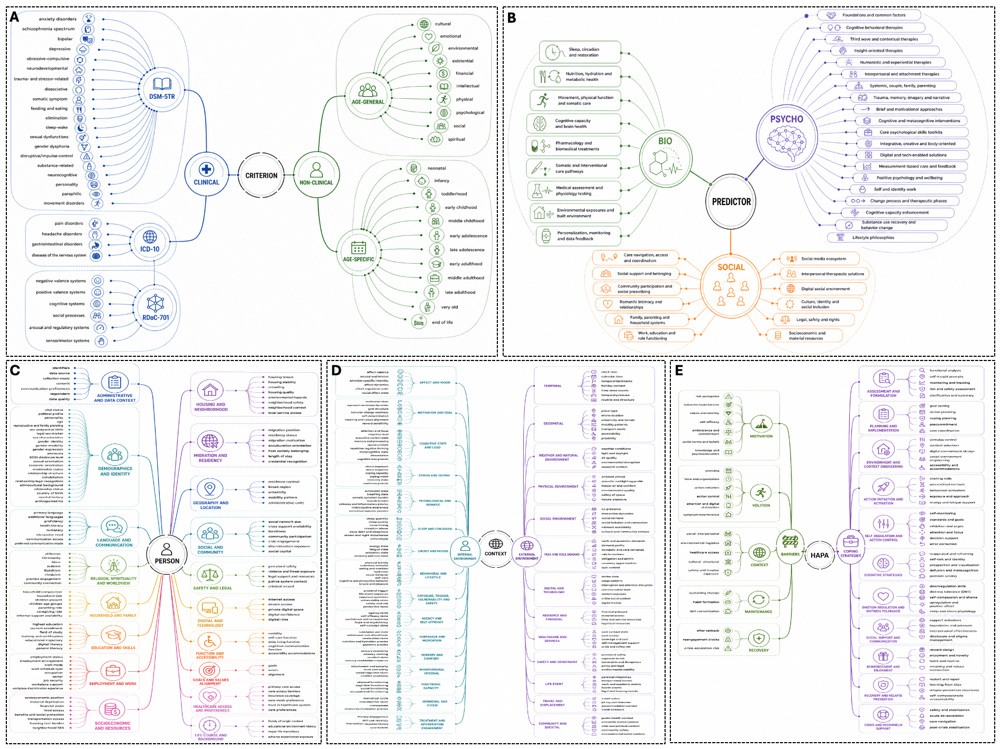
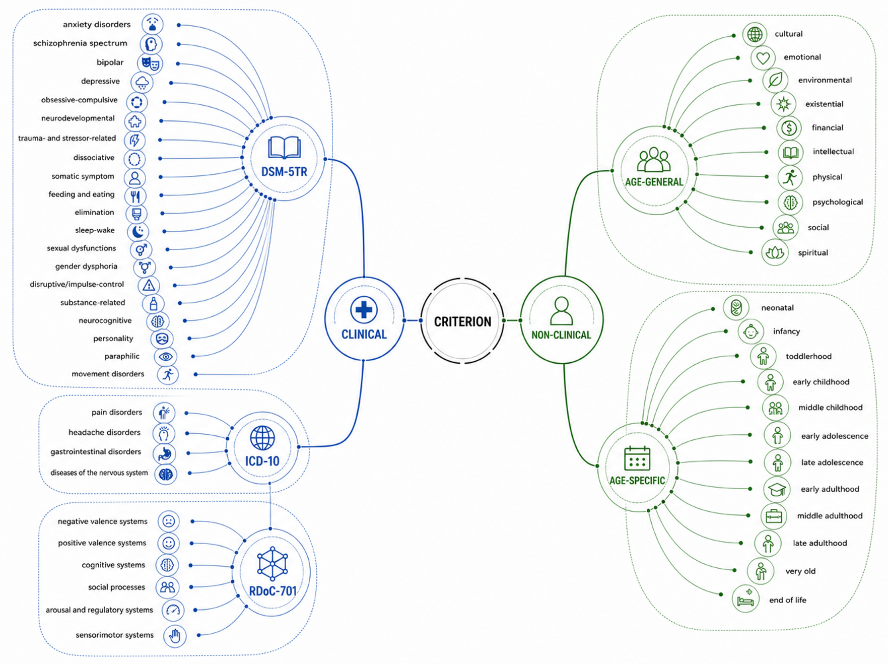
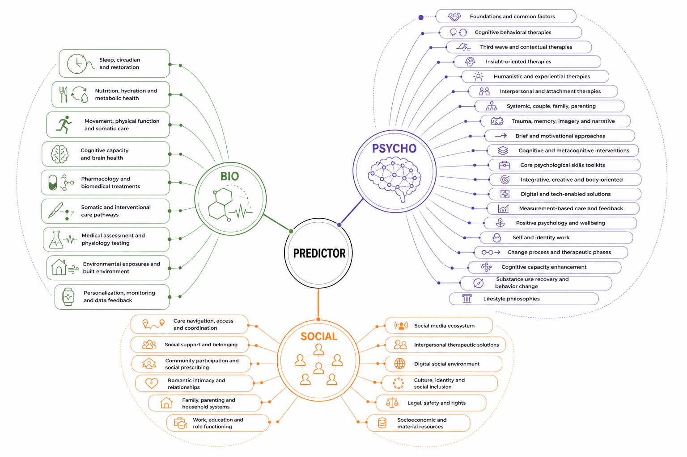
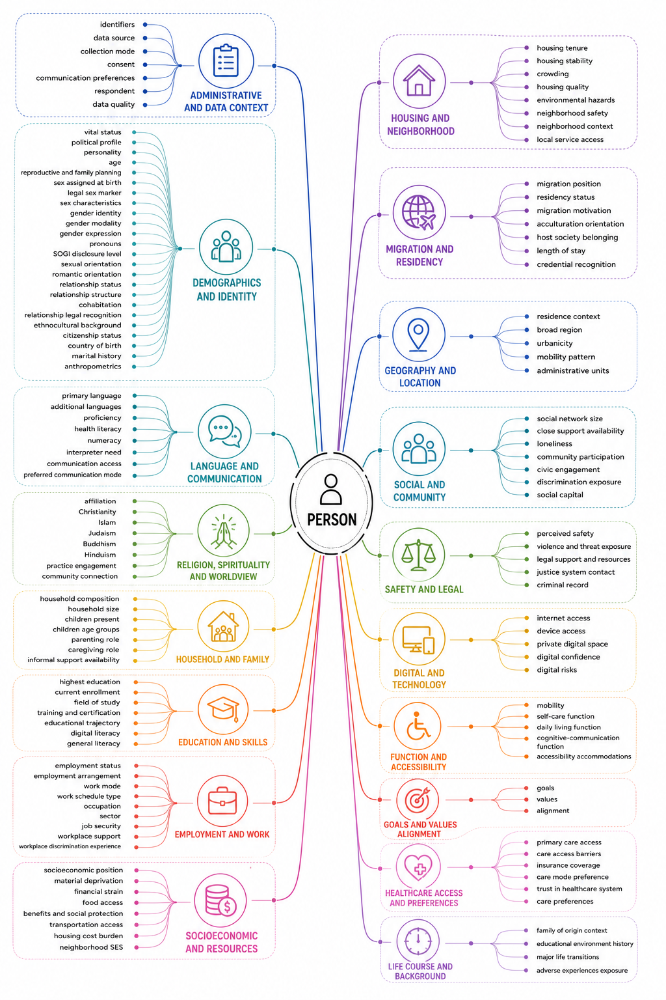
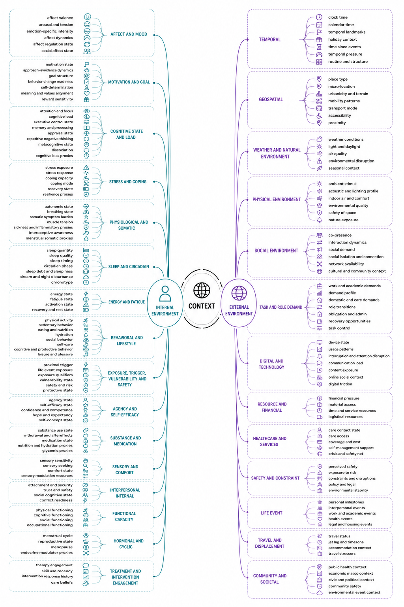
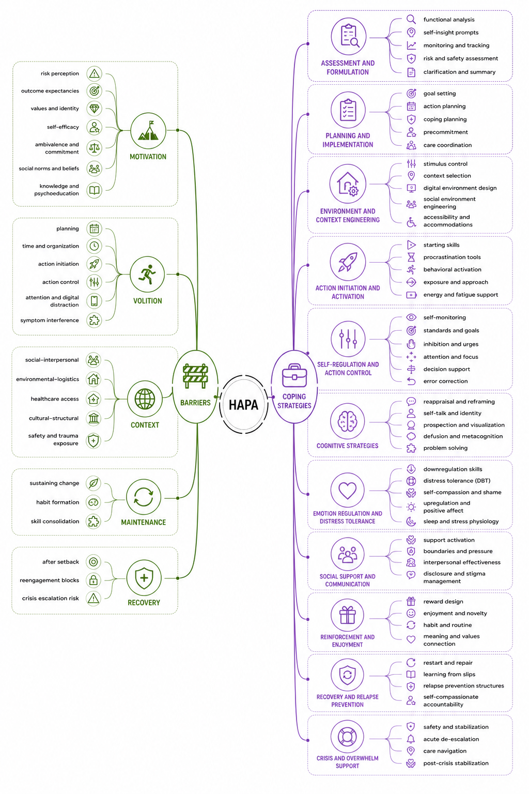

# PHOENIX Ontology

The PHOENIX ontology is a five-part knowledge structure that constrains all reasoning and decision-making across the PHOENIX engine pipeline. Five stable sub-ontologies encode the clinical and contextual dimensions the engine needs to operate: what problems to address (CRITERION), what interventions to apply (PREDICTOR), who the person is (PERSON), what their current situation is (CONTEXT), and how to translate insight into behaviour change (HAPA). Together they enforce structural guarantees on every stage output and prevent the engine from operating outside its clinically grounded scope.

  

---

## CRITERION

CRITERION defines the **problem space** — every mental health variable that the engine can identify, label, and track. It is grounded in three evidence bases: **DSM-5TR** (20 disorder categories covering the full psychiatric classification), **ICD-10** (pain, headache, gastrointestinal, and neurological conditions extending beyond psychiatry), and **RDoC-701** (six transdiagnostic functional domains: negative valence, positive valence, cognitive systems, social processes, arousal and regulatory systems, sensorimotor systems). A parallel **non-clinical branch** covers life-stage wellbeing dimensions applicable across the full developmental lifespan — from neonatal through end of life — and ten general wellbeing domains (cultural, emotional, environmental, existential, financial, intellectual, physical, psychological, social, spiritual).

In the PHOENIX engine, CRITERION labels are the output of **Step 01** (complaint operationalization agent) and serve as the structural anchors for all downstream steps: they define which network nodes are tracked, which predictors are relevant, and which intervention targets are defensible.

  

---

## PREDICTOR

PREDICTOR defines the **solution space** — every modifiable intervention, therapy, lifestyle factor, and treatment pathway the engine can propose. It is organized into three biopsychosocial branches:

- **BIO** — biological and somatic levers: sleep and circadian regulation, nutrition and metabolic health, movement and physical function, cognitive capacity and brain health, pharmacology and biomedical treatments, somatic and interventional care, medical assessment, environmental exposures, and personalization monitoring.
- **PSYCHO** — psychological therapies and cognitive tools spanning 20 sub-domains: from CBT foundations, third-wave therapies (ACT, DBT, mindfulness), insight-oriented and humanistic therapies, trauma and narrative work, motivational and brief approaches, core skills toolkits, digital and tech-enabled solutions, positive psychology, identity work, change process phases, cognitive capacity enhancement, substance use recovery, through to lifestyle philosophies.
- **SOCIAL** — social determinants and community resources: care navigation, social support and belonging, community participation, relationships and intimacy, family and parenting systems, work and education, socioeconomic resources, legal and safety support, culture and identity, digital social environment, and social prescribing.

In the PHOENIX engine, PREDICTOR entities are the candidates ranked by the BFS selector in **Steps 02–04** and instantiated as treatment options in the HAPA intervention at **Step 05**. The composite BFS score weights ontology similarity, HyDE-based RAG relevance, idiographic anchor carry-over from prior cycles, and domain bonus.

  

---

## PERSON

PERSON encodes **stable individual-level attributes** — the fixed and slowly changing characteristics of the person that modulate how the engine personalises its outputs. It covers 18 domains: administrative and data context, demographics and identity (including gender, sexuality, ethnicity, and relationship structure), language and communication, religion and worldview, household and family, education and skills, employment and work, socioeconomic resources, housing and neighborhood, migration and residency, geography and location, social and community participation, safety and legal context, digital and technology access, function and accessibility, goals and values alignment, healthcare access and preferences, and life course and background.

In the PHOENIX engine, PERSON data feeds the **barrier scoring formula** (`0.60·predictor + 0.20·profile + 0.15·context + 0.05·complaint`), modulates the BFS idiographic-nomothetic weighting, and personalises the HAPA intervention generation at Step 05. It also informs Step 01 complaint decomposition by providing demographic and developmental context for the operationalization agent.

  

---

## CONTEXT

CONTEXT encodes **dynamic, time-varying situational states** — the momentary and proximal conditions that determine what is clinically relevant right now. It is split into two high-level branches:

- **Internal environment** (17 sub-domains) — affect and mood, motivation and goal state, cognitive load and executive control, stress and coping, physiological and somatic state, sleep and circadian status, energy and fatigue, behavioral and lifestyle patterns, exposure and vulnerability, agency and self-efficacy, substance and medication state, sensory and comfort, interpersonal internal state, functional capacity, hormonal and cyclic context, treatment engagement, and personalization preferences.
- **External environment** (13 sub-domains) — temporal context, geospatial context, weather and natural environment, physical environment, social environment, task and role demands, digital and technology context, resource and financial context, healthcare and services access, safety and constraints, life events, travel and displacement, and community and societal context.

In the PHOENIX engine, CONTEXT is the primary driver of **momentary adaptation**: it provides the EMA measurement targets for the HUA readiness classifier, informs the time-varying network analysis (tv-gVAR), enables cycle-to-cycle carry-over of current-state evidence, and determines the situational modifiers for the barrier scoring and HAPA phase assignment at Step 05.

  

---

## HAPA

HAPA provides the **behavioural science scaffold** for translating identified treatment targets into actionable digital interventions. It is structured across four dimensions aligned with the Health Action Process Approach:

- **Motivation phase** — risk perception and threat appraisal, outcome expectancies, task self-efficacy enhancement, and intention formation and commitment.
- **Volition phase** — action planning and coping planning, action initiation and control, maintenance stabilization, and recovery and lapse management.
- **Barriers** — a taxonomy of obstacles organized across five levels: motivational barriers (risk perception, outcome expectancies, values-identity conflicts, self-efficacy deficits, ambivalence), volitional barriers (planning failures, time and organization, action initiation, action control, attention and digital distraction, symptom interference), contextual barriers (social-interpersonal, environmental-logistical, healthcare access, cultural-structural, safety and trauma), maintenance barriers (sustaining change, habit formation, skill consolidation), and recovery barriers (after setback, reengagement blocks, crisis escalation risk).
- **Coping strategies** — an 11-category library of evidence-based responses matched to each barrier class: assessment and formulation, planning and implementation, environment and context engineering, action initiation and activation, self-regulation and action control, cognitive strategies, emotion regulation and distress tolerance, social support and communication, reinforcement and enjoyment, recovery and relapse prevention, and crisis and overwhelm support.

In the PHOENIX engine, HAPA drives **Step 05** entirely: the HAPA phase classifier assigns each patient to their current motivational-volitional stage, the barrier scoring formula identifies the highest-priority obstacles, and the coping strategy library generates the personalised digital intervention with phase-appropriate techniques, barrier-matched coping responses, and EMA-anchored monitoring targets.

  

