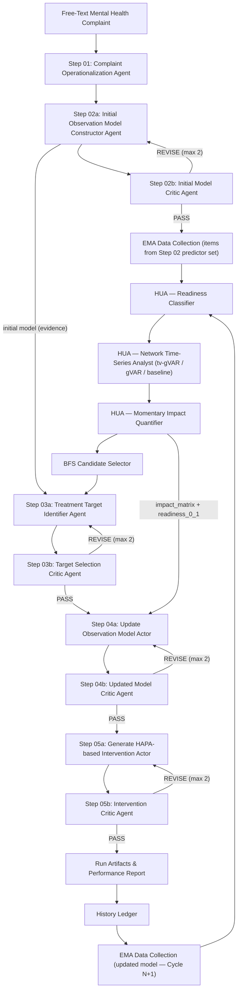

# PHOENIX Architecture Overview

## Executive Summary

PHOENIX is a **pre-determined sequential Multi-Agent System** for personalised mental-health treatment generation. A free-text mental health complaint enters; an ontology-constrained, HAPA-based intervention plan exits. Five LLM stages, each with a critic guardrail, are linked by a quantitative Hierarchical Updating Algorithm (HUA).

> **No orchestrator.** The stage sequence is fixed; each stage's output deterministically feeds the next.

---

## Architecture Diagram

*Regenerate:* `python src/overview/create_flowchart.py`

---

## Full Stage Sequence

> **Steps 03a/04a are co-located** in `03_TreatmentTargetIdentification/01_prepare_targets_from_impact.py`.

---

## Agent Directory

### LLM Generative Agents

| Step | Agent | Location | Role |
|---|---|---|---|
| 01 | Complaint Operationalization Agent | `01_OperationalizationMentalHealthProblem/` | HTSSF fusion (embedding + BM25 + token-overlap + fuzzy) → LLM re-rank top-50 → single CRITERION leaf |
| 02a | Initial Observation Model Constructor | `02_ConstructionInitialObservationModel/` | HyDE-based predictor RAG; bipartite criterion × predictor network; `relevance_score_0_1` per edge |
| 02b | Initial Model Critic | `step02_initial_model_critic_*` | `predictor_grounding · criterion_continuity · ontology_strictness · evidence_quality` → PASS / REVISE |
| 03a | Treatment Target Identifier | `03_TreatmentTargetIdentification/01_prepare_targets_from_impact.py` | Integrates BFS candidates + impact + network + initial model → `ranked_predictors` + `recommended_targets` (≤ 3) |
| 03b | Target Selection Critic | `step03_target_selection_critic_*` | `predictor_grounding · evidence_quality · safety_considerations · ontology_strictness` → PASS / REVISE |
| 04a | Update Observation Model Actor | co-located in `01_prepare_targets_from_impact.py` | `fuse_updated_model_matrix`: `idiographic_weight = clamp(0.30 + 0.50·readiness)` → refined shortlist |
| 04b | Updated Model Critic | `step04_observation_update_critic_*` | `predictor_grounding · criterion_continuity · bfs_depth_balance · fusion_consistency` → PASS / REVISE |
| 05a | Generate HAPA-based Intervention Actor | `05_TranslationDigitalIntervention/01_generate_hapa_digital_intervention.py` | Barrier scoring; coping selection; phased EMA delivery plan |
| 05b | Intervention Critic | `step05_hapa_intervention_critic_*` | `reasoning_quality·0.17 · evidence_grounding·0.21 · hapa_consistency·0.16 · medical_safety·0.16` → PASS / REVISE |

### HUA Quantitative Agents

| Agent | Module | Role |
|---|---|---|
| Readiness Classifier | `HUA/01_time_series_analysis/01_check_readiness/` | Variance · stationarity · n-obs → `readiness_report.json`; selects tier: tv-gVAR / gVAR / baseline |
| Network Time-Series Analyst | `HUA/01_time_series_analysis/02_network_time_series_analysis/` | Fits tv-gVAR / stationary gVAR → contemporaneous & temporal edge weights |
| Momentary Impact Quantifier | `HUA/02_hierarchical_update_ranking/` | Predictor-level impact coefficients → `impact_matrix.csv` |
| BFS Candidate Selector | `src/backend/utils/agentic_core/shared/target_refinement.py` | `score = 0.45·mapping + 0.25·HyDE + 0.20·idiographic_anchor + 0.10·domain_bonus` |

---

## Design Principles

| Principle | Detail |
|---|---|
| **Pre-determined sequence** | No orchestrator — each stage's output is the next stage's input |
| **Free-text entry point** | HTSSF fusion + LLM adjudication → single CRITERION leaf |
| **EMA follows the model** | Collection items derived from Step 02 predictor selection, not gathered upfront |
| **Five ontologies** | CRITERION · PREDICTOR · PERSON · CONTEXT · HAPA — structural constraint propagation throughout |
| **BFS scoring** | `0.45·mapping + 0.25·HyDE + 0.20·idiographic_anchor + 0.10·domain_bonus` |
| **Nomothetic × idiographic fusion** | `idiographic_weight = clamp(0.30 + 0.50·readiness)` — shifts with EMA data quality |
| **HAPA barrier scoring** | `0.60·predictor + 0.20·profile + 0.15·context + 0.05·complaint_match` |
| **Guardrail critics** | Every LLM stage paired with a critic → PASS / REVISE (max 2 revisions) |
| **Iterative lineage** | History ledger preserves all cycle artefacts; `previous_cycle_scores` feed next BFS |

---

## Output Guarantees

Every LLM stage emits three files:

| File | Content |
|---|---|
| `stage.log` | Human-readable reasoning trace |
| `stage_events.jsonl` | Structured event log (per LLM call) |
| `stage_trace.json` | Timing, counts, section token estimates |

All structured outputs are schema-validated (Pydantic) with ontology hard-enforcement on all predictor, barrier, and coping paths before persistence.
