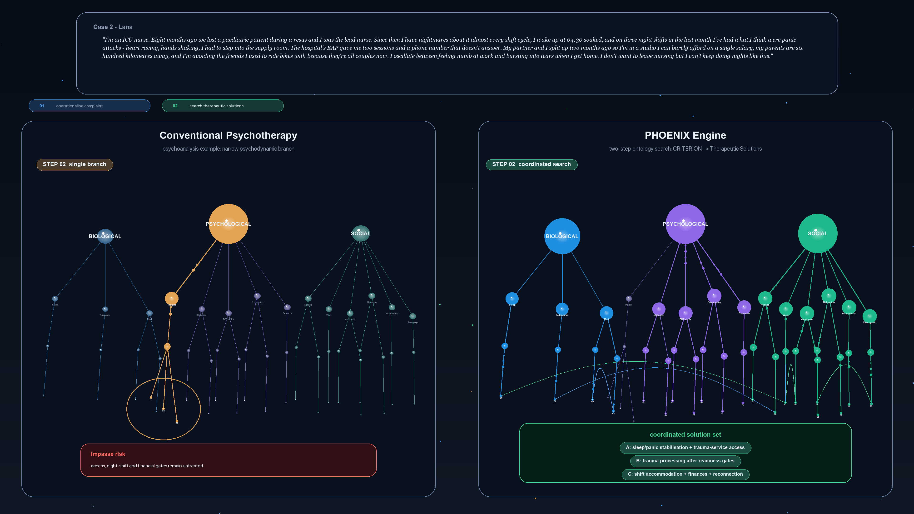

<div align="center">

# 🎬 PHOENIX Case Demonstration

### A controlled two-step comparison between conventional psychotherapy and the PHOENIX Engine on a single illustrative clinical case.

</div>

---

## Overview

This folder hosts a short motion-graphic illustration of how the PHOENIX Engine differs from a conventional single-discipline psychotherapy workflow when both are given the **same free-text complaint**, the **same CRITERION variables**, and the **same four-layer Therapeutic-Solutions hierarchy** extracted from the PHOENIX `PREDICTOR` ontology. The point of the demonstration is structural rather than rhetorical: conventional psychotherapy traditions are valuable and used for clear theoretical reasons; PHOENIX is positioned here as a complementary, breadth-first reasoning layer that systematically explores the full biopsychosocial candidate space before treatment selection.

The demonstration runs on **Case 2 — Lana**, a 29-year-old ICU nurse whose complaint contains comorbid post-traumatic, anxiety, sleep, grief-spectrum, and socioeconomic-contextual signals. The case is intentionally complex so that the contrast between narrow-branch and breadth-first exploration becomes legible at thesis-figure scale.

---

## The video

<div align="center">

https://github.com/stvsever/ThesisMaster/raw/main/src/backend/overview/video_material/renders/mp4/lana_stepped_phoenix_comparison.mp4

*If the inline player does not load, the [direct MP4 download](renders/mp4/lana_stepped_phoenix_comparison.mp4) and the [hi-res poster frame](renders/posters/lana_stepped_phoenix_comparison.png) are available next to this README.*

</div>



**Format.** 34 s, 3840 × 2160 (4K), 24 fps, H.264 / yuv420p, ≈ 8 MB. Rendered locally from Pillow-composed frames piped through `ffmpeg`. The renderer is intentionally lightweight (no headless browser, no Manim) so the video reproduces deterministically on any machine with Python and `ffmpeg` available.

---

## What the video shows

### Step 1 — Operationalisation of the free-text complaint *(00:00 — 00:13)*

The complaint is rendered in full and then progressively underlined span by span. Each highlighted span is operationalised into a CRITERION variable — a leaf of the PHOENIX criterion ontology that names the underlying mental-health concept the span maps to. The same set of CRITERION cards appears on **both** panels, which is the controlled-experiment property of the demonstration: there is no information asymmetry at the input stage, so anything that diverges afterwards is the consequence of the search policy alone.

The cards include trauma re-experiencing, autonomic hyperarousal, cue-triggered panic, trigger-context avoidance, alternating numbing and flooding, relational-grief features, isolation, night-shift role conflict, financial precarity, and a service-access failure (the unanswered EAP line).

### Step 2 — Coordinated search through the Therapeutic-Solutions hierarchy *(00:13 — 00:34)*

Both panels now traverse the same four-layer hierarchy that PHOENIX assembles from the `PREDICTOR` ontology:

- **Layer 1** &nbsp;|&nbsp; Major branches *(BIO, PSYCHO, SOCIAL — and within conventional psychotherapy, the dominant theoretical branch)*
- **Layer 2** &nbsp;|&nbsp; Domain families *(Sleep & Circadian, Trauma Memory Work, Care Navigation, …)*
- **Layer 3** &nbsp;|&nbsp; Intervention classes *(Stabilisation & Resourcing, Distress-Tolerance Skills, Service Matching, …)*
- **Layer 4** &nbsp;|&nbsp; Concrete leaf-level candidates *(`Window_Of_Tolerance_Education`, `Trauma_Informed_Service_Option_Matching`, `Brief_Breath_Reset`, …)*

The **left panel** shows a conventional psychodynamic / psychoanalytic-style traversal: it follows an interpretively coherent path through one well-understood theoretical branch — *transference exploration, defence identification, affect-defence interpretation* — and concludes with a single deep candidate. The path is not wrong, but it stays within one theoretical lineage. The closing card is a compact red **impasse-risk** annotation indicating that several criterion clusters — financial precarity, service-access failure, occupational night-shift exposure — have no candidate in the explored branch and therefore cannot be acted upon within this frame.

The **right panel** shows the PHOENIX BFS-3phase search: smaller moving particles traverse multiple branches in parallel, cross-branch arcs visualise the criterion-level dependencies that the search resolves jointly (for example, the *trauma-informed service matching* social leaf gating the *EMDR-informed processing* psychological leaf, which in turn gates the *night-shift-exposure reduction* occupational leaf). The panel terminates with a **coordinated solution set** — a small green card listing four cross-branch candidates that together cover the full criterion deck.

---

## Why it matters — without overstating

The video is a single illustrative case, not an empirical evaluation. The empirical evaluation of the modular agentic framework against five healthcare professionals through the pre-registered double-blind LLM-as-Judge protocol is reported separately and is awaiting the expert-coded responses at the time of writing. What this short video does support is a precise, falsifiable structural claim:

> Under matched inputs and a matched solution hierarchy, a breadth-first three-phase candidate selector exposes coordinated cross-branch candidates that a narrow-branch traversal does not, and resolves criterion-level dependencies (where one candidate must be in place for another to become executable) that an independent single-discipline search cannot recover.

That is the modest, structural argument the demonstration is designed to convey. The thesis discussion gives the full caveats — limitations of LLM-emitted mapping calibration, the simulation-only scope of the candidate-selection benchmark, and the empirical placeholder for the agentic-framework evaluation.

---

## Reproducibility

The renderer is included in the repository for transparency (it is not invoked by any deployment path):

```bash
python3 src/backend/overview/video_material/scripts/render_case_step_videos.py --case lana
```

Optional flags `--width`, `--height`, `--fps`, and `--duration` allow faster preview renders. The default is the published 4K / 24 fps / 34-second configuration.

The rendering scripts and the second case (Maarten) are kept locally for thesis development and are intentionally excluded from this public repository; see `.gitignore` in this folder.

---

<div align="center">

*Part of the PHOENIX Engine — Personalised Hierarchical Optimization Engine for Navigating Insightful eXplorations.*

</div>
